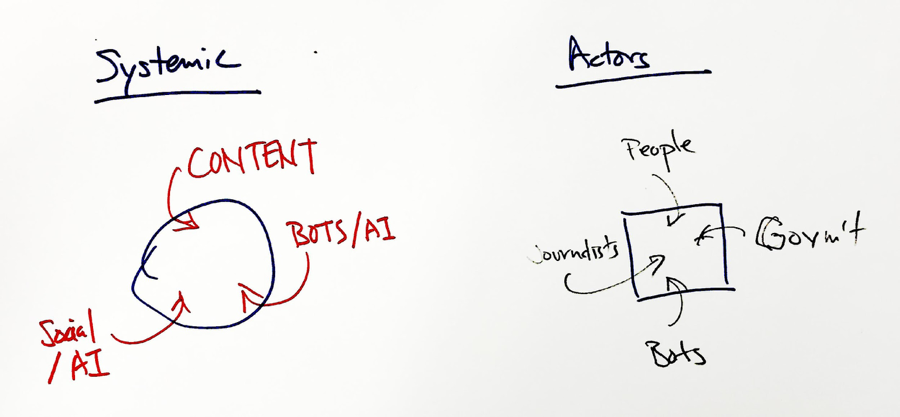
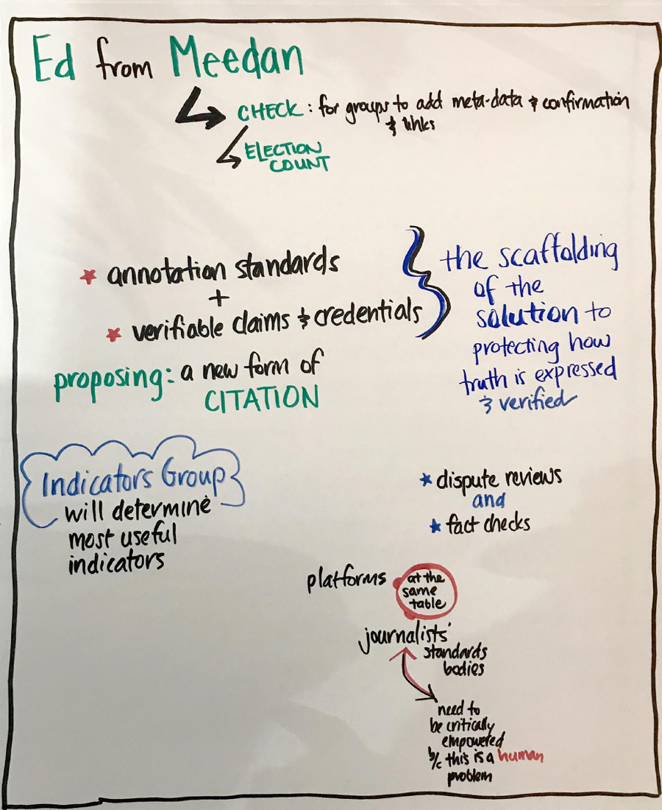
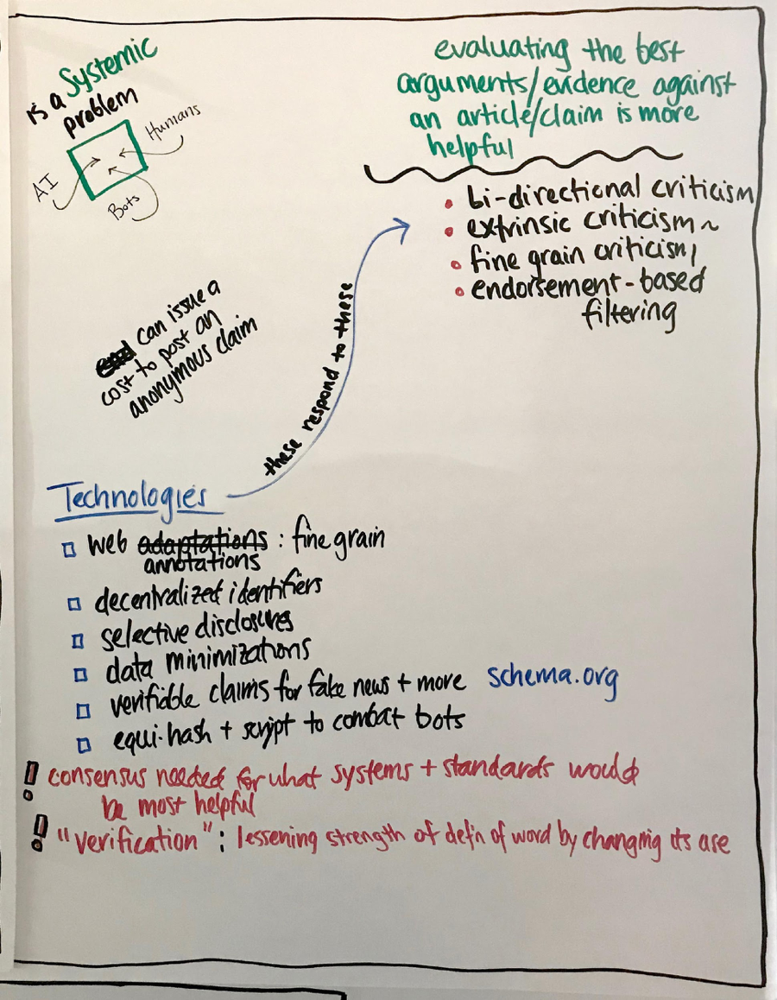
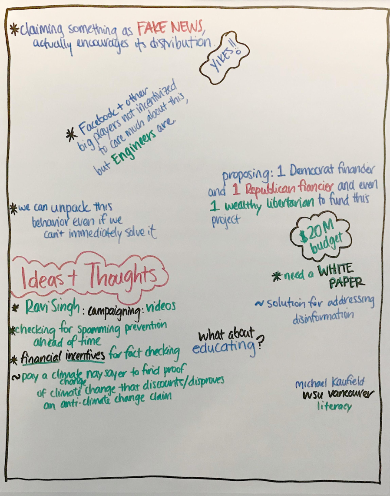

October 4, 2017 
Rebooting Web of Trust Workshop 
Cambridge, Mass

# Notes from Meeting with Credibility Indicators Working Group

**Guests:** Ed Bice of Meedan and Sandro Hawke of W3C 
**W3C Community Credentials Group leadership:** Christopher Allen, Manu Sporny and Moses Ma 
**Date/Time:** October 4th, 12:30 to 3:30 pm

## Notes

*These are top level findings, please feel free to annotate if you
attended this meeting.*

-   Ed provided some background about his history and the history of
    Meedan, which builds digital tools for global journalism
    and translation.

-   History of Meedan: https://meedan.com/en/about/

-   Meedan has a solution called “Check” to enable confirmations and add
    meta-data https://meedan.com/check

<!-- -->

-   Annotation standards and verifiable claims and credentials are the
    scaffolding of the solution to protecting how credibility indicators
    are expressed, and how various version of the ‘truth of a link,
    claim, or source’ is verified/contextualized and how these
    conclusions are expressed.

-   Dispute reviews (Facebook) and fact checks (Google) are already
    being utilized by the platforms, this is an opening for our work to
    have scaled impact.

-   *Essentially, we are proposing a new form of citation that is fully
    digitally enabled and applicable to the 21^st^ century*

-   It is the job of the Credibility Indicators Working Group to
    determine most useful indicators, building consensus from a the
    groups stakeholders

-   Platforms, journalist’s standards bodies, and other stakeholders all
    need to participate in this process if it is going to succeed.

-   Our working group does hold one bias: While we seek to develop
    indicators that take human and machine generated signals,
    Journalists need to be critically empowered because this is a human
    problem, not an algorithmic problem at its heart

-   Fake news is a systemic problem, and we need to address the
    incentives for journalists, content creators, platforms, standards
    bodies, and consumers.

-   This includes consideration of human and non-human distribution
    networks, Algorithms and AIs that might play a role in content
    creation and distribution, and the social/psychological aspects of
    taking in content corrections and correction distribution.

-   Evaluating the best arguments/evidence against an article/claim is
    often more helpful than trying to prove the truth of the article or
    claim

-   ‘Showing the work’ done in fact-checks and debunks is critical. As
    is ‘showing the context’ of the person and/or organization/media
    provider doing the work.

-   Responsive technologies include

    -   bi-directional criticism

    -   extrinsic criticism (a component of Xanadu)

    -   fine grain criticism (Ibid)

    -   endorsement-based filtering (scripts that filter on certain
        credential criteria)

-   Many technologies from the Credentials community can help, and
    emerging technologies, like selective disclosure and data
    minimization will help a LOT

-   We need to be aware of [*www.schema.org*](http://www.schema.org) -
    they have already implemented a first pass at ClaimReview - though
    by their own admission this should be extended.

-   We need to investigate Equihash and Scrypt to combat bots and sibyl
    attacks through proof of work strategies

-   There was some philosophical discussion around the use of the word
    “verification” as things are now considered to be partially true -
    the conclusion suggested by Ed was that we need a model that allows
    many parties to make assertions about the context/veracity/truth of
    a given claim/image/link/source. The meaning of the word ‘verified’
    then becomes a function of how effectively a given system user has
    deployed that word. And the measure of effectiveness is likely to be
    a combination of performance broadly defined and performance defined
    within a network (or other) filter.

-   Psychological perspective: Labeling a source as “Fake News” actually
    encourages its distribution by the recalcitrant, according to the
    research

-   Facebook and other platform providers are in some cases more
    incentivized to care about engagement than combating fake news; but
    there is no question that their engineers, and perhaps even members
    of their management team, are very motivated to have FB serves
    broader social goals.

-   We need to unpack the psychological payoffs and motivations behind
    fake news problem – this requires more research

-   Everyone is liking the idea of balancing Democrat and 1 Republican
    philanthropic funding sources to fund this project

-   Total budget proposed is \$20 Million

-   The first thing we need is a white paper, which Ed and Manu will
    write

-   Question: what about education? Answer: look at what Michael
    Caufield is doing at WSU Vancouver around really nuanced digital
    literacy - much better than what FB is currently promoting.

-   Ideas and Thoughts: let’s use videos to educate, need to embed
    financial incentives for fact checking – this might be possible via
    tokenization

**Action Planning:**

The agreement going forward requires five bold first steps -

1\) Moses and Ed will work on a Powerpoint presentation for funders, to
be ready in TWO WEEKS

2\) Moses and Ed have a goal to raise a quick round of philanthropic
funding, from a balanced mix of liberal/conservative philanthropists, to
pay for initial work and get fast traction

3\) Manu and Ed - as proxy for CIWG - will work a white paper with the
goal of merging CHECK from Meedan and VCs from CCG, to be completed
within ONE MONTH

4\) Sandro will work on getting our proposal on a fast track with the W3C.

5\) Get work done quickly so we can present to key stakeholders and
socialize at the W3C meeting in San Francisco in a month, with the goal
of achieving rapid traction

## People who signed up to help

Name          |
  ------------------|
  Tiemae             |
  Joao Santos        |
  Shireen Mitchell   |
  Raghav Chawla      |
  Mark S. Miller     |
  Gautam Dhameja     |
  Ryan Grant         |
  Kim Duffy          |

## Graphic Recordings follow

*\* Graphic Recording by Claire Rumore, FutureLab*
