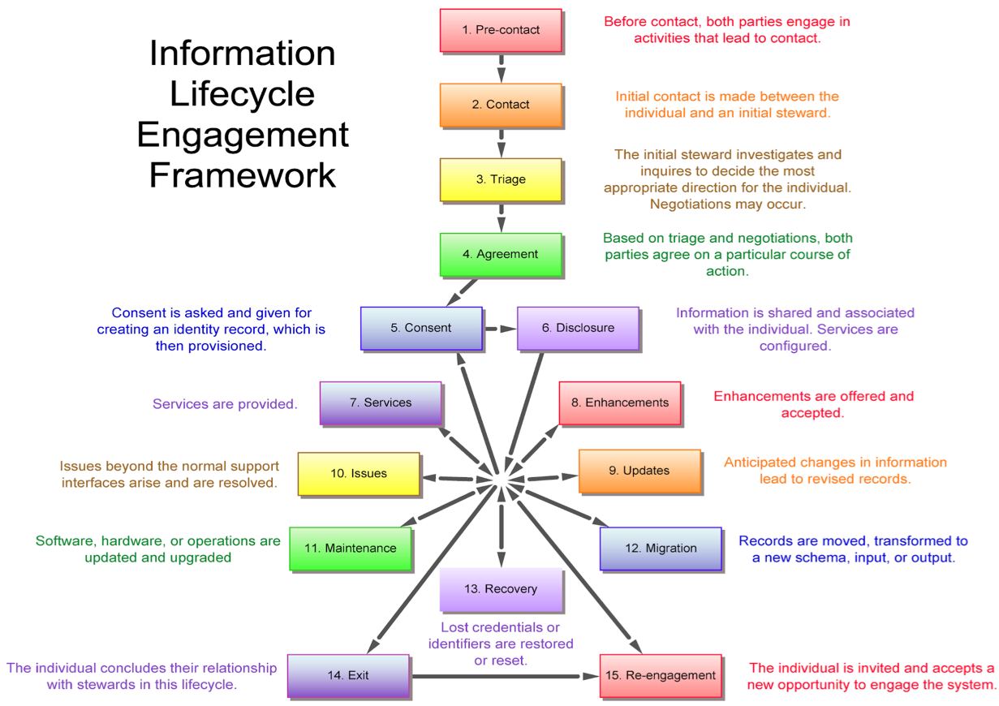

Amira 1.0.0
===========

A Self-Sovereign Web of Trust Engagement Model

Joe Andrieu, Legendary Requirements,
&lt;[*joe@legreq.com*](mailto:joe@legreq.com)&gt;

Christopher Allen
&lt;[*ChristopherA@LifeWithAlacrity.com*](mailto:ChristopherA@LifeWithAlacrity.com)&gt;

Shannon Appelcline, Skotos Tech,
&lt;[*shannona@skotos.net*](mailto:shannona@skotos.net)&gt;

Lyre Calliope, [*@CaptainCalliope*](http://twitter.com/captaincalliope),
Securing Change,
&lt;[*lyre.calliope@gmail.com*](mailto:lyre.calliope@gmail.com)&gt;

Toni Lane Casserly, [*@tonilanec*](http://www.twitter.com/tonilanec),
Cultu.re / CoinTelegraph, &lt;[*tlc@cultu.re*](mailto:tlc@cultu.re)&gt;

Tim Chen, Coding Dojo,
&lt;[*tchen@codingdojo.com*](mailto:tchen@codingdojo.com)&gt;

David Fields, PTB Ventures,
&lt;[*dave@ptbvc.com*](mailto:dave@ptbvc.com)&gt;

Michael Haley, AlphaPoint,
&lt;[*michael@alphapoint.com*](mailto:michael@alphapoint.com)&gt;

Shireen Mitchell, Stop Online Violence Against Women,
&lt;<founder@stoponlinevaw.com>&gt;

Heather Vescent, The Purple Tornado,
&lt;[*puissant@heathervescent.com*](mailto:puissant@heathervescent.com)&gt;

Kaliya “Identity Woman” Young, @identitywoman,
&lt;[*kaliya@identitywoman.net*](mailto:kaliya@identitywoman.net)&gt;

With special thanks to Pat McBennett and Raghav Chawla for their
contributions.

**Introduction**

*This paper began as a collaborative project at the fifth Rebooting the
Web of Trust\[[1](#fn-1)\] workshop, held in Cambridge MA in October 2017. We
reinterpret Christopher Allen’s Rebooting the Web of Trust user
story,\[[2](#fn-2)\] through the lens of the Information Lifecycle Engagement
Model (described in Appendix A). We present a human-centric illustration
of an individual’s experience in a self-sovereign, decentralized
realization of the Web of Trust as originally conceived by Phil
Zimmerman for PGP.\[[3](#fn-3)\]*

In our scenario, Amira is a successful programmer working in Boston at a
prestigious multi-national bank. Outside of working hours, Amira wants
to give back to her community by writing software that matters. On the
advice of her friend Charlene, Amira joins RISK, a self-sovereign
reputation network that connects developers with projects while
protecting participants’ anonymity, building reputation, and sending &
receiving secure payments.

**Information Lifecycle Engagement Model**

We describe Amira’s interactions with RISK using the Information
Lifecycle Engagement Model. This 15-stage model captures the experience
of a single, fictitious individual as she interacts with a proposed
system. The model intentionally limits our focus to the connected
experience of a single human protagonist and the people they engage
along the way, in one or more paragraphs about interactions in each of
the 15 stages. The Information Lifecycle Engagement Model is based on
the work of Joe Andrieu and Ian Henderson from [**The Customer-Supplier
Engagement Model Quick
Starter**](http://kantarainitiative.org/confluence/display/infosharing/Customer-Supplier+Engagement+Model+Quick+Starter)\[[4](#fn-4)\],
which uses a 12-stage model to illustrate how personal data stores can
interact with CRM systems throughout the customer-supplier lifecycle.
The model doesn’t attempt to define all the requirements or
possibilities in a system, but rather serves as a lens to focus on a
single person across the full set of fifteen categories of interactions.
These fifteen stages ensure that we have an example of each of the
different steps found in essentially all information systems.

The engagement model presents the human context from “both sides” of the
system. On one side, Amira interacts with RISK. On the other side, a
variety of counter-participants in different roles interact with Amira
through the system.

We adopt a “strawman” architecture for exploring the human experience
using one possible embodiment. This non-binding set of suggested
functionality allows authors and readers to sanity-check the feasibility
of both individual actions and system capability. The strawman
intentionally defers deeper technical issues for future design and
implementation. The goal is not to design any particular implementation,
but instead to make sure the basics ideas are sound from start to
finish, capturing the human requirements independent of any specific
technology choice.

The strawmen helps us understand the proposed system by providing a
clear idea of one workable approach. Any actual implementation could
vary greatly as subsequent constraints lead to different choices. This
paper focuses on the human interactions and human relevance that drive
the model, and not the specifics of any proposed implementation.

**Participants**

Throughout Amira’s experience, different individuals create and query
information in RISK.

> **Amira** (**BWHacker)** — The main actor in our model, Amira has a
> politically tense background. She wants to use her programming skills
> to positively impact the lives of oppressed people around the world.
>
> **Ben** (**BigBen44) —** A manager at a women’s services non-profit.
> Ben is looking to connect with developers to build an app that helps
> women in difficult situations.
>
> **Charlene** (**CharlieOne) —** Amira’s friend and fellow developer.
> She knows Ben indirectly through the RISK Web of Trust. She helps
> Amira get started with RISK.
>
> **Elias** — A mercenary working for the Syrian Hacker Army.
>
> **Firefly** — A developer who becomes Amira’s successor as an app
> maintainer.

**Services**

RISK depends on, and is partially constituted by a number of
**decentralized** services.

-   **anonymous Internet** — support for private communication over
    the Internet.

-   **identifiers** — self-sovereign, pseudo-anonymous sources of
    cryptographic authority. DIDs, etc.

-   **name discovery** —ability to use an identifier to look up a unique
    name or address within a community.

-   **web of trust reputation database** — non-hierarchical sources for
    reputation information (claims and evidence) about people within
    a community.

-   **status database** — non-hierarchical sources of revocation and
    other status information for identifiers, names, and reputation.

-   **community** — synchronous and asynchronous discussions and
    documents for a group of people.

-   **source code repository** — location for developers to collaborate
    on software.

-   **contract** — method for multiple parties to securely contract
    services with each other.

-   **payment** — settlement between parties.

-   **app marketplace** — repository for people to be download and
    install software created by developers.

**Assumptions**

-   All parties are users of computer and internet technology; most have
    above-average level of technical sophistication including
    development skills.

-   The Syrian Army is actively monitoring “enemy” technology and
    technologists and engaging in attacks against enemy technology.

-   Amira and Charlene have an existing relationship; Charlene is
    willing to vouch for Amira.

-   Charlene has a mobile application for RISK installed and configured
    on her mobile phone.

-   Decentralized developer systems (e.g., git) are easily available
    and accessible.

-   Amira uses multiple security technologies and techniques to protect
    her privacy.

-   Amira is not monitoring changes to her account while on vacation.

**Stage 1 — Pre-contact**

***Parties engage in activities that lead to contact.***

Amira escaped life in Syria when she was 16. She resettled in Boston
with an adoptive family and studied computer science in college, taking
a job at a bank. The job pays her bills, but Amira wants to make a
difference in the world.

One night, Amira discovers her opportunity. She sees an interview with
Ben, the executive director of an international non-profit, on Cambridge
Community Television\[[5](#fn-5)\], sharing his organization’s vision for
supporting oppressed women around the world. Ben envisions smart phones
as the key to creating anonymous communication channels that safely and
reliably connect women with local community services, specifically
supporting victims of domestic violence and sexual assault.

Amira wants to contribute to Ben’s cause, but worries that engaging in
activism might affect her job.

Fortunately, as the public face of his non-profit, Ben has established
an identifier, BigBen44, on RISK and freely shares it with contacts,
leaders, and developers who might help his cause. This gives Amira an
opening to reach out to Ben.

**Stage 2 — Contact**

***Initial contact is made between the individual and an initial
steward.***

At a local professional event, Amira runs into her good friend Charlene,
a fellow technologist with shared values. Amira discreetly asks Charlene
if she knows anything about RISK and how Amira might use it to
anonymously contribute to Ben’s project.

Using her phone, Charlene searches RISK’s developer network to see if
Ben is a connection. Charlene finds him, separated by just two degrees.
The proximity of their connection on RISK allows Charlene to send Ben a
priority introduction. But first, Charlene needs to understand if RISK
is the right option for Amira.

Charlene tells Amira she may be able to help and suggests they meet
after the event, without the crowd of their professional peers nearby.
Amira agrees, intrigued and hopeful.

**Stage 3 — Triage**

***The initial steward investigates and inquires to decide the most
appropriate direction for the individual. Negotiations may occur.***

To understand if RISK is a good fit for Amira, Charlene asks about her
goals and concerns. The security features of the system require a
non-trivial amount of effort and if Amira isn’t committed to doing it
properly, the consequences could be worse than if she found some other
way to work with Ben.

Amira explains that she wants to contribute to the project without fear
of reprisal because of her background, ethnicity, or gender. She has
strong technical skills and a proven ability to deliver useful, quality
software. She wants work where she is valued for what she does, without
risking reprisals for who she is. She wants to work in a purpose-driven
community and to make a difference in the world, not just to make money.
She’d like to find a community of peers who share these ideas — people
willing to help shift society’s systemic imbalances anchored in race,
gender, location, and nationality while protecting real-world
identities.

Amira’s ambition perfectly matches the reasons RISK was created. RISK is
a decentralized system that relies on transactional reputation to
establish pseudonymous identities for people who want to keep their real
identities secret and to change the world. RISK connects developers with
stakeholders to build projects that improve people’s lives, while
simultaneously protecting the identity of those using the system.
Charlene decides to act as an introducer for Amira.

**Stage 4 — Direction**

***Based on triage and negotiations, both parties agree on a particular
course of action.***

Charlene tells Amira about RISK, explaining the culture as well as the
underlying cryptography and consensus mechanisms that make it all work.
Amira immediately gets it and hopes she can find the relevant work
missing in her life.

Charlene writes down the URL for the RISK decentralized source code
repository, along with her public-facing RISK handle: CharlieOne. In
addition, Charlene verbally shares a memorable phrase that will identify
her on the RISK network, instructing Amira to repeat it, remember it,
and to NOT write it down. Charlene asks Amira to create her own phrase
to uniquely identify herself to Charlene when they connect online. To
help remember the phrases, they use them in conversation a few times.
It’s a bit silly, but the humorous reinforcement helps.

Charlene recommends that Amira set up a bootable portable drive (e.g., a
USB stick) to create a secure development environment while working with
RISK. Fortunately, Amira isn’t afraid to build a Linux machine from
scratch; she’s confident she can get the system up and running.

**Stage 5 — Consent**

***Consent is asked and given for creating an identity record, which is
then provisioned.***

During their conversation, Charlene explained that RISK is a system of
mutual, earned trust, founded on a commitment to respect individuals’
right to privacy. This commitment is captured in a mutual agreement
between all parties using the network.

RISK’s Terms of Engagement include:

1.  A Code of Ethical Conduct.

2.  A confidentiality agreement to maintain anonymity of others and to
    keep the details of any project confidential — except and unless
    explicitly authorized through the reputation system.

3.  Consent to use a registered pseudonym for tracking activities and
    building reputation.

4.  Procedures for registering and challenging reputation records.

5.  Procedures for updating RISK, including the Terms of Engagement and
    an IP assignment.

6.  Limited liability to minimize frivolous lawsuits and
    exorbitant claims.

7.  A warranty of suitability that requires that participants act on
    their own free will as an individual and not an organization,
    entity, or company.

Using a credential she generated, 1) Amira cryptographically signs a
statement containing her new pseudonym, *BWHacker*, short for “Better
World Hacker,” 2) the name and a hash of the current RISK terms
(v2.4.1), and 3) a statement that BWHacker agrees to these terms. This
signed statement is a consent receipt. Amira stores it on her drive and
on a backup service, then posts a hash of the receipt to RISK, recording
the timestamp when BWHacker formally agreed to the terms.

**Stage 6 — Configure**

***Information is shared and associated with the individual. Services
are configured.***

Using a bootable portable drive, Amira sets up a development environment
on her laptop. She then downloads RISK and begins working through the
READMEs and installation directions.

Amira creates a unique identifier in the form of a DID, a Decentralized
Identifier,\[[6](#fn-6)\] on the RISK decentralized network. This binds a
publicly-verifiable credential to her new pseudonym, BWHacker. This
pseudonym and the related DID will allow Amira to securely interact
through RISK without revealing her real-world identity.

Using the RISK introduction system, Amira looks up CharlieOne and
contacts her using her new handle, BWHacker. RISK establishes a secure
channel and Amira and Charlene confirm each other’s identity using their
memorized phrases. Now both parties have each other’s cryptographically
secure identifiers for ongoing correspondence.

**Stage 7 — Services**

***Services are provided.***

To bootstrap her reputation on RISK, Amira creates a Verifiable
Credential, self-asserting her capabilities as a mobile software
developer with her RISK pseudonym. Through RISK, she sends CharlieOne
the credential and asks for an endorsement. Charlene is happy to help.
She creates an endorsement, including the original claim, posts a hash
of the endorsement to RISK, then sends both to BWHacker. This allows
BWHacker to selectively enable anyone to verify the credential and
CharlieOne’s endorsement. In addition, Charlene has the ability to
revoke this endorsement in the future, if the need arises (for example,
the BWHacker account is transferred or penetrated.).

Now that BWHacker is in RISK with a suitable endorsement, CharlieOne
introduces BWHacker to BigBen44. As BWHacker has not performed work
through RISK, BigBen44 relies on CharlieOne’s endorsement giving her
status as a subject matter expert. BigBen44 shares background materials
with BWHacker outlining the project and specifying requirements,
timeframe, and acceptance criteria. After reviewing the materials,
BWHacker responds with some clarifying discussion points and a draft
statement of work (“SoW”). The discussion reflects a depth of
professional experience that confirms CharlieOne’s endorsement to
BigBen44. BigBen44 and BWHacker formalize the SoW into a contract to
create a “SisterSpaces” app using a RISK contract template that includes
pricing, technical milestones, evaluation criteria, and progress
payments.

RISK’s standard contract templates have support for cryptographic smart
contracts. Upon contract signing, BigBen44 deposits the full contract
value in bitcoin into a smart escrow account. Each time BWHacker commits
code achieving a technical milestone, BigBen44 is sent a randomized code
sample to review as well as the ability to spin up a demo guaranteed to
utilize the current codebase. BigBen44 can comment and suggest changes
as desired. Upon milestone acceptance, the smart contract releases
agreed-upon payment to BWHacker’s wallet address. Finally, the smart
contract independently records BWHacker’s code delivery as well as
BigBen44’s reviews and final acceptance in the RISK reputation system.

The completed version 1.0.0 of the SisterSpaces app acts as the final
deliverable of the contract. Ben accepts the deliverable, and final
payment is released. Amira and Ben then post reviews of the experience
of working together; this is a reputational claim on each other’s RISK
identity, confirmed by the execution of their smart contract.

**Stage 8 — Enhancements**

***Enhancements are offered and accepted.***

After successfully delivering BigBen44’s project and receiving a glowing
review, Amira decides to list her profile in the RISK developer
directory. She reviews other entries in the directory to find examples
of existing professional pseudo-anonymous profiles: RISK provides
professional profile templates that show recent projects and
endorsements. When creating her own profile, Amira opts out of
displaying a picture of herself on the BWHacker profile. She is careful
not to reveal any personal information. Her profile is stored on a
decentralized file system and linked to her BWHacker RISK account. When
people search RISK for developers, BWHacker’s profile will be displayed
with her endorsements.

**Stage 9 — Updates**

***Anticipated changes in information lead to revised records.***

After the account compromise (discussed in Stage 10) and creation of the
BWHacker2 pseudonym, Amira buys a hardware “wallet” to help isolate and
secure the credentials she uses to access RISK. She posts a transaction
to RISK using her initial BWHacker2 credential, replacing the public
part with one generated by her new wallet. The old credentials are no
longer valid and her identifier remains under her control through her
new credentials.

**Stage 10 — Problems/Issues**

***Issues beyond the normal support interfaces arise and are
resolved.***

Elias is a mercenary hired by the Syrian Hacker Army to track down and
hack the author of SisterSpaces — the app that Amira coded. Elias tracks
BWHacker’s interactions to a dev environment (the one on Amira’s USB
key) and captures the private keys associated with the BWHacker RISK
DID. Elias changes the master key in the RISK DID, stealing Amira’s
ability to communicate as BWHacker, and locking Amira out of her RISK
identity. Unfortunately for Amira, this hack happens while she is on
vacation. She doesn’t realize the account is compromised until she
returns two weeks later.

In this interim, Elias patches the SisterSpaces source code so that all
traffic is sent to a Syrian surveillance system. Posting as BWHacker,
Elias sends a message to BigBen44, telling him about “a security bug
fix” for SisterSpaces and strongly recommends immediately releasing the
“new and improved” v1.0.1. Ben, not realizing BWHacker’s account has
been compromised, submits the v1.0.1 update to the app store.

Returning from her vacation, Amira realizes she’s lost control of
BWHacker. Not only has a fake app been released, but she can’t even
check the git repo to see what has changed in the new version. Amira
calls Charlene for help. Charlene immediately revokes her endorsement of
BWHacker and sends a message to BigBen44, telling him that BWHacker has
been compromised along with SisterSpace’s code. Taking no chances, Ben
immediately disables BWHacker’s access to the git repository, reverts
the recent commits, updates the version, and pushes v1.0.2 to the app
store.

Unfortunately, Amira has no way to regain control of the original
BWHacker identity. Instead, She creates a new DID as BWHacker2,
repeating the steps she followed when she initially set up her account.
Amira generates her credentials directly, making a point to update them
with a more secure set as soon as possible (described in Stage 9
Updates). Amira recovers her reputational claims in Stage 13 Recovery.

**Stage 11 — Maintenance**

***Software, hardware, or operations are updated and upgraded.***

Meanwhile, members of RISK are considering an improvement proposal
concerning reputation claims. Originally, RISK reputations were limited
to one-on-one reveals. Under the proposed improvement, users can choose
to aggregate reputation data for presentation on their RISK profiles.

The majority of the RISK developers are in favor of the proposal, and it
gets approval. Developers update the code base with the new feature and
release the improvement. Users like Amira, Charlene, and Ben get a
notification that there is a new reference implementation available.
Separately, they download it and begin to use the new aggregated
reputations.

**Stage 12 — Migration**

***Records are moved, transformed to a new schema, input, or output.***

Seeing the power of displaying her RISK reputations on her profile,
Amira decides to move her BWHacker2 persona off RISK to CommonX, a more
widely-used system with more developers and projects. She
cryptographically links BWHacker2 to CommonX so that users of both
systems can verify that the two profiles reflect the same individual.
BWHacker2 then reaches out to her existing reputation sources to ask for
an endorsement of essentially the same reputation data in the new
system. While this is largely automated, it does require the original
author to countersign the reputational assertion in a format usable by
CommonX. As the authors do so, the migrated reputations start to appear
in BWHacker2’s CommonX profile.

**Stage 13 — Recovery**

***Lost credentials or identifiers are restored or reset.***

Unfortunately, Elias has taken complete control over the BWHacker
profile. There is no way for Amira to recover it, but she can recreate
the endorsements from her work as BWHacker. After setting up a new
profile, BWHacker2, Amira recovers the rest of the reputation claims
that were attached to BWHacker. She begins by contacting Charlene. They
meet in person to confirm the change. Charlene creates and records an
endorsement that BWHacker2 is the person formerly known as BWHacker,
prior to the account compromise. CharlieOne then reaches out to
BigBen44. After he verifies that CharlieOne’s credential keys have not
recently changed, Ben connects with BWHacker2 and asks some questions of
his own to verify this is really the person he’s been working with. Ben
updates his account to set up a maintenance contract with BWHacker2 and
double checks that the contract with BWHacker is terminated with
prejudice.

**Stage 14 — Exit**

***The individual concludes their relationship with stewards in this
lifecycle.***

Amira had thought about leaving her job at the bank to work on developer
projects full-time, but then the bank gives her an opportunity she can’t
refuse. The CIO asks Amira to oversee a comprehensive overhaul of its
internal systems as its new Principal Architect. Amira accepts. However,
in her new role, she realizes she no longer has the time to continue
working on SisterSpaces. She tells BenBen44, and they agree to end the
maintenance contract they had established after the initial version
shipped. Ben hires a new developer, Firefly, gives them write access to
GitHub, and revokes BWHacker2’s access. To avoid future inquiries for
development, Amira removes her BWHacker2 profile from the directory.

**Stage 15 — Re-engagement**

***The individual is invited and accepts a new opportunity to engage the
system.***

A year into the rebuild, the bank’s CIO has been replaced and Amira is
fed up. She decides to try Firefly’s latest version of SisterSpaces.
While the app has become popular, she notices it is straining under
heavy technical debt. Amira reaches out to BigBen44 once again as
BWHacker2. The two rekindle their connection, and Ben tells Amira that
he wants her back full time. Amira gives notice to the bank, reactivates
her BWHacker2 profile in the directory, and steps into her dream job of
writing socially-responsible software.

**Appendix A**

**Information Lifecycle Engagement Model**

The 15-stage model presented here is an instance of an Information
Lifecycle Engagement Framework, as illustrated below.

Each phase in the model presents a concise description of one or two
interactions illustrating the phase. Rather than attempting to describe
every interaction across multiple users, the engagement model captures
illustrative interactions for each phase in the lifecycle of a
particular individual’s engagement with the system. The model should be
readable as a sympathetic narrative, clarifying the motivations of all
parties and the viability of the described use. We use it to tease out
the human requirements independent of the underlying technology.

This Information Lifecycle Engagement Model is based on the work of Joe
Andrieu and Ian Henderson from [**The Customer-Supplier Engagement Model
Quick
Starter**](http://kantarainitiative.org/confluence/display/infosharing/Customer-Supplier+Engagement+Model+Quick+Starter)\[[7](#fn-7)\]*.*
We have re-interpreted and expanded the 12 phases of the
Customer-Supplier Engagement Model for suitability to identity
information more generally, shifting away from the commercial nature of
the relationship. We also added Maintenance, Migration, and Recovery
phases to address the needs of operating an ongoing system.

The premise remains: working through each phase of the model provides a
comprehensive yet lightweight review of necessary transactions for a
given system. This can be done before a detailed specification, giving a
coherent view of functional requirements that supports subsequent
innovation as design and implementation details emerge.

## Footnotes

<a name="fn-1">\[1\]:</a> [*http://www.weboftrust.info/*](http://www.weboftrust.info/)

<a name="fn-2">\[2\]:</a> [*https://github.com/WebOfTrustInfo/rebooting-the-web-of-trust-fall2017/blob/master/topics-and-advance-readings/RWOT-User-Story.md*](https://github.com/WebOfTrustInfo/rebooting-the-web-of-trust-fall2017/blob/master/topics-and-advance-readings/RWOT-User-Story.md)

<a name="fn-3">\[3\]:</a> [*https://en.wikipedia.org/wiki/Web\_of\_trust*](https://en.wikipedia.org/wiki/Web_of_trust)

<a name="fn-4">\[4\]:</a> [*http://kantarainitiative.org/confluence/display/infosharing/Customer-Supplier+Engagement+Model+Quick+Starter*](http://kantarainitiative.org/confluence/display/infosharing/Customer-Supplier+Engagement+Model+Quick+Starter)

<a name="fn-5">\[5\]:</a> https://www.cctvcambridge.org/about

<a name="fn-6">\[6\]:</a> https://github.com/WebOfTrustInfo/rebooting-the-web-of-trust-fall2017/blob/master/topics-and-advance-readings/did-primer.md

<a name="fn-7">\[7\]:</a> [*http://kantarainitiative.org/confluence/display/infosharing/Customer-Supplier+Engagement+Model+Quick+Starter*](http://kantarainitiative.org/confluence/display/infosharing/Customer-Supplier+Engagement+Model+Quick+Starter)
