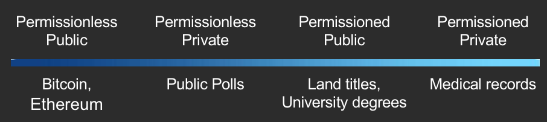

# When GDPR becomes real, and Blockchain is no longer Fairy Dust

#### by Marta Piekarska (Linux Foundation), Michael Lodder (Evernym), Zachary Larson (Economic Space Agency), Kaliya Young (Identity Woman)

## Abstract

The General Data Protection Regulation (GDPR), enacted by the European
Parliament in 2016, was designed to give users more control and rights
over their personal data. Companies and governments will find it
increasingly difficult to be GDPR compliant with current industry
practices. Following the implementation date of May 25, 2018, managing
data will be both toxic and expensive. Many precious resources will be
required for improving and maintaining the security, privacy, and
governance of personal data. Methods for storing less personal data will
ease the burden of GDPR compliance. This document describes the GDPR
requirements and the different approaches to digital identity solutions
and finally explains why distributed ledger technology may offer an
opportunity for enterprises to simplify data management solutions that
are GDPR compliant.

## GDPR Requirements

Existing infrastructure has data processors housing personal data and
continually collecting more. A person may not know what is known about
them until they petition for it. To do so is often difficult, and
entities are not required to respond in a timely manner or at all.
Entities often share the data with others for marketing purposes. This
can cause people to receive unwanted, automated marketing without
understanding why they are being targeted. A person can call a number to
be put on a do-not-contact list, but companies frequently do not honor
those requests. Sometimes data processors have incorrect data, and it
can be difficult for individuals to correct this data and those changes
may not be propagated to other entities. A person must try to fix the
problem with every data processor they know about that has knowledge of
said data. GDPR was created to help address these issues.

Unfortunately the GDPR brings with it liabilities forth for enterprises
storing personal data. When personal data becomes compromised or known,
the companies become targets of government investigations and lawsuits.
Smaller entities can go bankrupt when this happens. Compliance with data
laws can require costly and time intensive audits, investing in
technical and physical security measures, and hiring trained security
personnel in order to limit their liability to financial lawsuits and
fines and susceptibility to attacks. Many companies do not want to store
personal data, but nonetheless have a real, operational need for the
data. The current infrastructure doesn’t enable just-in-time access that
would enable them to get access to what they need, when they need it,
without storing the data themselves.

GDPR\[1\] is composed of articles that outline the rights of individuals and
requirements of data processors. The following is a brief summary of
rights granted to individuals:

   * *Article 6*: Lawfulness of processing. Processing personal data is
generally forbidden if it is not expressly allowed by law or if the
impacted persons have not consented to processing these data.

   * *Article 7: *The right of consent. The individual must consent to
personal data being collected and can rescind that consent at any time.

   * *Article 12*: The right to ask questions about use of personal data
and to seek redress if questions are not answered in a clear, concise,
timely manner.

   * *Articles 13 & 14*: The right to know how personal data is used at the
time of collection and the length of time for which it will be stored
and contact information for the collecting party.

   * *Article 15*: The right to access the personal data that is being
processed.

   * *Article 16*: The right to have incorrect personal data rectified.

   * *Article 17*: The right to have personal data erased when it is no
longer necessary for the purposes for which they were collected and
there is no legal ground for their maintenance.

   * *Article 18*: The right to restrict data processing where the data is
inaccurate, its collection unlawful, or its processing no longer
required.

   * *Article 19*: The data collecting party must inform all additional
data processors with whom it shares personal data to cease processing
data that has been rectified or erased.

   * *Article 20*: The right to receive their personal data in a
structured, commonly-used, machine-readable format which they can freely
share with other data processors.

   * *Article 21*: The right to object to personal data being used to
profile or market to them.

   * *Article 22*: The right to not be subject to legal outcomes that rely
solely on automated data processing.

   * *Article 25: *The right to have the minimal amount of data stored as
necessary for data processors to do their work.

   * *Article 77: *The right to file a complaint against non-compliant data
processors.

   * *Article 80: *The right to have a legal representative for actions
against data processors.

The following is a brief summary of obligations for data processors:

   * *Article 24: *Must be able to demonstrate all processing and handling
is in compliance.

   * *Article 28: *Must notify data owners when data will be shared with
other processors.

   * *Article 29: *Must only process authorized data for authorized
purposes.

   * *Article 30: *Must maintain a record of all data processing activity.
The record must include who processed it, what was processed, where it
was processed or transferred, when it will be erased, and the security
measures in place when it was done.

   * *Article 32: *Must protect the data using pseudonymization and
encryption. They must ensure those measures are tested regularly and
they can recover in the event of failures.

   * *Article 33: *Must notify data owners and other data processors in the
event of a breach within 72 hours of first having become aware of the
breach.

   * *Article 37: *Must appoint a data protection officer.

   * *Article 50: *The transfer of data must only happen to countries
deemed as having adequate data protection laws.

The legal language must be translated into the technical requirements.
Without a solid solution, organizations in breach of GDPR can be fined
up to 4% of annual global turnover or €20 Million (whichever is
greater). This is the maximum fine that can be imposed for the most
serious infringements e.g. not having sufficient customer consent to
process data or violating the core of Privacy by Design concepts. There
is a tiered approach to fines, e.g. a company can be fined 2% for not
having their records in order (article 28), not notifying the
supervising authority and data subject about a breach or not conducting
impact assessment. It is important to note that these rules apply to
both controllers and processors — 'clouds' will not be exempt from GDPR
enforcement.

### Technical Requirements

GDPR mandates in order to ensure a complete solution that protects the
user, or data subject, and restricting enterprises can be summarized in
the following points.

   * *Availability*: The user should always have access to their data, no
matter if it is stored locally or remotely. The data should be protected
from leakages or attacks because it affects availability.

   * *Completeness:* Data and any event regarding its collection and
processing should be recorded.

   * *Confidentiality*: Only parties involved in the exchange of data
should be able to see details of that transaction.

   * *Correctness:* The accuracy of data recorded should be assured.

   * *Immutability:* There should be no possibility of changing
historical logs.

   * *Integrity:* The content of the data store should be protected
from malicious or unintentional changes.

   * *Interoperability*: Users should be able to combine data coming from
various sources.

   * *Non-repudiation:* Interaction with any data should not be
deniable at later points in time.

   * *Rectification & Erasure:* Users must be able to change or erase their
personal data. They must also be able to make corrections of erroneous
data.

   * *Traceability:* Any occurrence of processing data must be traceable
and linkable to previous occurrences of processing of that data.

GDPR is the standard proposed by European Parliament to protect European
citizens and return control over private data to the users. However, the
legislators in other parts of the world recognize that same need for
data control. For instance in China the Standing Committee of the
National People’s Congress is already proposing changes similar to the
GDPR\[2\]. Similarly there are laws like COPPA in the U.S. and PIPA in
Japan.

## Self-Sovereign Identity as a Model for GDPR

The requirements of the GDPR call for user control of their private
information. One model for that is self-sovereign identity, a movement
that started before the GDPR was introduced. It grew out of the
user-centric identity efforts to support the individual being at the
core of their own digital identity. The community is focused on how
various sophisticated cryptography and shared distributed ledgers allow
for this to actually happen. The community focused on user-centric
identity and personal data control has several times produced guiding
rules or principles that also align with the vision of GDPR and actually
influenced its authors. In 2005 Kim Cameron defined Laws of Identity, In
2010 during the same week while Phil Windley\[3\] and Kaliya Young\[4\]
each posted created Personal Data Ecosystem principles.

Several years ago new term gained traction“self-sovereign identity”.
Devon Lefretto first used the term Self-Sovereign Authority within the
VRM community in 2011 and in that context worked to articulate its
meaning. References to Self-Sovereign Identity appear in 2015 by John
Edge founder of ID2020. Devon Lofretto published a post defining the
term in February 2016\[5\]. Christopher Allen circulated ideas about a
set of principles and published them in the spring of 2016.\[6\].

The W3C standardization body has a Verifiable Claims Working Group,
which focuses on the API definitions. While Self-Sovereign identity is
not necessarily the ideal or full answer to GDPR requirements, it is
interesting to analyze it, as one of the possible solutions.

Christopher Allen describes 10 principles for a self-sovereign identity
system.

1.  The person behind the identity needs to **exist**. Nobody can be
    fully digital, we need to have a “sum” (*cogito ergo sum*) that is
    the core of who one is. That sum can later be described in a digital
    form.
2.  Every entity should be in **control** of their identity. One who is
    described by the identity is the one who is the central authority on
    that identity. While others can make claims to one’s identity, they
    should not have control over it.
3.  The owner should always be able to **access** their own data. This
    is crucial, as without access to the identity, a user has no way to
    prove or control who they are. While the owner may not be able to
    modify all the information about themselves (if there is a court
    ruling attached to a given identity the owner should not be able to
    change that ruling) but they have to be made aware of all that is
    created about them.
4.  The self-sovereign system requires full **transparency** on all the
    algorithms, designs, management and updates. In order to ensure that
    transparency, the algorithms used should be free, open-source and
    well described in public.
5.  Such systems must be designed to exist forever, or be **persistent**
    as long as the owner wants them to be. The protection mechanisms
    and the implementation details may change over time, but the core
    identity should last forever. All of these should not prevent the
    rule of right to be forgotten, that allows users to request removal
    of any of the claims made to their identity. Thus, the identity must
    be separate from claims made to it.
6.  Following the understanding that the system needs to be available
    and persistent, the data should be **portable**. The identity cannot
    be held by a single entity, in case this body disappears. A
    transferable architecture allows for a simple method of moving data
    while keeping it available.
7.  Connected to this is the rule of **interoperability**. All systems
    should communicate and be available anywhere in the world, not
    dependent on borders or governments.
8.  As users have full control over the system, they should also be able
    to give their **consent** to the entities that want to use their
    identity. The design should be such, that while allowing for full
    information sharing, it is always done with the agreement of the
    user.
9.  It should also be strongly **minimized**. When requested to disclose
    information, the system should give away as little as possible.
10. Finally, the user should always be the center of interest, and his
    rights should be **protected**, independently from any third party.

While the rules describing self-sovereign identity are theoretical and
not necessarily all applicable, most modern systems that aim to define
who we are and how we work in the digital world, closely follow the
above principles.

Let us now look at the technical implementations proposed by various
entities.

## Technical Approaches to Digital Identity

A few different technical proposals for digital identity have been
incubated in conjunctions with the discussions of self-sovereign
identity. These may offer strong foundations for any attempts to
implement GDPR-compliant data. Some follow the self-sovereign rules
defined above, while some only take what is needed. This section
describes the two most mature developments. However, it is important to
recognize that each suits the use case it is trying to solve. We have
yet to see a universal approach acceptable on a global scale.

### Decentralized Identity Foundation – DIF
***Self-Sovereign Focus:*** Control

In May 2017, a new movement was started: creating a space for
organizations to develop fundamental primitives, protocols and tools for
an interoperable ecosystem under the umbrella of Decentralized
Identity
Foundation\[7\].
We no longer live in a world which accepts Big Brother approach of
storing all information about everyone in one place. However, a huge
paradigm shift needs to happen when moving from a centralized registry
of objects — people, devices and entities — to a decentralized system.
This requires development of new specifications, protocols, formats, and
implementations for cross-chain rooting, indexing, and resolution of
decentralized identifiers and names.

Decentralized Identifiers (DIDs) are used as bases for a verifiable,
fully self-controlled digital identity. In ideal circumstances, DIDs
adhere to the rules of self-sovereignty, not being dependent on any
centralized registry, identity provider or certificate authority. To
interact with the world, DIDs need to be resolved to DID documents that
contain authentication mechanisms, authorization information and service
endpoints. With that, a trusted interaction can be started with an
entity. Unlike in a traditional model, where identity management system
relies on a centralized authority that provides cryptographic trust
verification, in a DID world we need a federated identity
management\[8\]. Following the dictums of Privacy by Design\[9\], each
entity may have as many DIDs as necessary, to respect the entity’s
desired separation of identities, personas and contexts.

Such a decentralized design eliminates the need for registries that
collect all the identifiers as well as centralized certificate
authorities for key management. Thus, a traditional Public Key
Infrastructure is no longer valid. However, it needs to be replaced with
a new, DLT-compliant architecture, where each entity can have its own
root authority. Such system is called a Decentralized PKI.

As interoperability is one of the key focuses of DIF, DID methods that
allow for collaboration with centralized or federated systems can be
developed and are encouraged as a bridging mechanism. Until now there
have been several DID methods proposed by various entities ranging from
the Sovrin Foundation, Bitcoin, Ethereum and Verifiable Claims worlds.

However, DID is only the way to address the objects; the question is how
to store and compute the data. The control and ownership need to be in
the hands of the object, and such a system is also part of what DIF is
focusing on, through their work on Hub. A Hub is a data store containing
semantic data objects at well-known locations. Objects in a Hub are
signed by an identity and mapped to semantic data objects through an
API. Anyone can address them through a global namespace.

The final part of DIF’s work is Chainpoint, which focuses on a scalable
protocol to anchor data in the Blockchain and generate receipts. One of
the key factors of the future interactions of entities on a Blockchain
will be trust and reputation. These can only be built through
attestations between groups of individuals and businesses, which can be
used make important decisions in personal and business life.

## Verifiable Claims
***Self-Sovereign Focus:*** Minimization

Today we have to reveal the maximum amount of information even when
interacting with people who do not need that information. Moreover, it
is hard to prove your qualification over the internet: driver’s license,
proof of age, education qualification is not easily verifiable. The
purpose of verifiable claims is to resolve these twin issues. This is
what the W3C Verifiable Claims Working Group\[10\] is focusing on. 150+
individuals and organizations are now planning how to create, store,
transmit and verify digital credentials via the Internet.

A Verifiable Claim is defined as an identifier that describes four roles
within a single capsule. An Issuer issues verifiable credentials about a
specific Subject. The Holder stores credentials on behalf of a Subject.
Holders are typically also the Subject of a credential. The Verifier
requests a profile of the Subject. A profile, which contains a specific
set of credentials. The verifier verifies that the credentials provided
in the profile are fit-for-purpose. The Identifier Registry is a
mechanism that is used to issue identifiers for Subjects.

Why do we need Verifiable Claims? Because one does not need to show
their precise age, just that they are above a certain age. That they are
capable of driving. That they are eligible to practice as a medical
doctor and so on. This minimizes data disclosure, fulfilling one of the
precepts of self-sovereign identity while simultaneously reducing
liability for a data holder, especially under laws like GDPR.

### Blockchain Solutions to GDPR

Blockchain is a up-and-coming technology for digital
identities, and is already in extensive use for DIF and other
self-sovereign-focused technologies. It needs to be part of any
discussion about GDPR compliance. However, some fear that the Blockchain
is the exact opposite of what GDPR requires of enterprises.

If we take public, permissionless Blockchain, then indeed
everything that happens within such a system is visible and available to
anyone. However, the domain of Blockchain technology expands beyond
permissionless, public versions. If we take the example of medical
records, nobody would find it advisable or feasible to store their data
in a public ledger. For such a use case we need a private, permissioned
ledger, where only a certain group of people may access the ledger for
read and write purposes.

Then, there is a middle ground – between the crypto
currency and medical records – for instance certification. Issuance of
such should be limited to those, who are eligible to certify that a
given person can hold a given certificate. However, anyone should be
able to inquire about the validity of the claim.

So, there is space for both permissionless-private, and
permissioned-public blockchains. It is our strong belief that there will
not be one Blockchain to rule them all, but a spectrum of solutions to
choose from, which we summarize in the Figure below.

Given such a model, we can compare how GDPR requirements can map into
what Blockchain-based solution may offer.

First rule is to ensure **availability**. The user should always have
access to their data, no matter if it is stored locally or remotely. The
data should be protected from leakages or attacks as that stands against
availability. Availability is ensured through the distribution of nodes
that hold the same copy of the ledger and create a peer-to-peer network.
Even if a certain number of these nodes becomes unavailable, the others
still have an identical copy of the same data, meaning that participants
can always access the information. Such data may not be leaked to
participants outside of the permissioned structure of the Blockchain,
which relies on a good governance model and a solution that is built
with security in mind.

This assumption, however, holds true for most technologies no matter
whether they include Blockchain or not. Distributed Ledger Technology
(DLT) is a way of ensuring availability, immutability, transparency and
lack of reliance on trusted third party. As any innovation, it can only
serve as part of a bigger solution that has to be properly architected
and designed with all the right principles in mind.

Next GDPR requirement is **completeness**: every event and data have to
be recorded. This is exactly what Blockchain and DLT have been designed
for. The structure of a chain of blocks connected to one another through
cryptographic hashes of previous blocks ensures that any changes in the
history will be immediately recognized and flagged as an error. Any
event or data is announced to the participants of the network and once
they agree on the content of it, it is published on the Blockchain and
stored forever.

Similarly, the rule of **correctness**, meaning that there is an
assurance of accuracy of data, is guaranteed with DLT. Of course, data
always needs to be verified before it is amended to the Blockchain. The
sheer fact it exists on the Blockchain, does not mean it is true.
However, the participants of the network achieve a consensus over the
correctness of the (hopefully) audited data any changes cannot be done
to it.

This also means that **integrity** of data is protected. As the GDPR
states, the content of the data store should be protected from malicious
or unintentional changes. This happens by default in the Blockchain as
changes can only be introduced as new inputs to the blocks. If
University X publishes incorrectly that Alice has passed an exam with a
grade B on a Blockchain, the only way to change that is to introduce a
new transaction announcing that the previous entry was incorrect, and
that Alice passed the exam with a grade A.

**Immutability** of Blockchain technology has been mentioned several
times here and is also a requirement of the GDPR.

There are several ways how to achieve **confidentiality**, meaning that
only parties involved in the exchange of data can be able to see the
details of the transaction, while still ensuring full transparency,
where any occurrence of processing data must be traceable and linkable
to previous occurrences of processing of that data. In a setting where
we can create permissioned Blockchain and confidential transactions, one
can also create channels where only parties involved in the exchange of
the information know the content of it, while the outside world
acknowledges that such a transaction occurred. This is done in case of
Hyperledger Fabric Channels\[11\] or Hyperledger Sawtooth’s Private
UTXO Transaction
Family\[12\].
There are also many more ways to do this, depending on the technology
chosen.

**Transparency**, on the other hand, can be implemented by tracking the
transactions by their precise hashes and referring to their exact
position in a Blockchain, so that any new exchange can clearly build on
top of it.

### Creating an Off-Chain Wallet

One of the big challenges facing enterprises when it comes to complying
with GDPR is the user-centric approach to data handling. It is no longer
the case that a company can store and be responsible for all the
information. Quite the opposite – it is the users themselves that now
need to decide if and how would they like to share their data. Thus, the
requirements for: **consensual** data sharing, where permission can be
withdrawn any time; **data minimization**, where only the minimum amount
of data should be requested by a company; and **interoperability and
portability, **where user can combine data from various sources. In the
world of traditional databases this may be impossible to solve. However,
with decentralized DLT systems, where one does not rely on a trusted
third party such a solution no longer creates a problem.

Using DIDs and Verifiable Claims, we can create a solution that puts the
users in charge and control of their identity, a wallet of attestations
and information about them that only they are responsible for. This is
what Hyperledger
Indy\[13\] is
focusing on: creating a Blockchain so that the identities can be kept in
a secure storage and the Blockchain can serve as a common reference to
the records, rather than storage for the data itself. By having a single
wallet of identity, the data is portable and interoperable. we can
ensure revealing minimum data disclosure. As for consent, simple
interaction with an entity and recording that transaction counts as a
timestamped consent form; no further action is needed.

The only way to stay GDPR compliant with immutable records is to avoid
uploading person-related data at all. A ledger can only be used for
verifiers of person related data. Not even hashing can be used as a
method of anonymization, but rather pseudonymization. In fact, logical
deletion by this definition can only be achieved by verifiers in the
form of ZKPs. It is had to recognize what information will be considered
sensitive in the future, and thus, ZKPs seem like the right answer for
handling personal data.

With the design of off-blockchain wallets that are recorded on a
Blockchain, we achieve **rectification**. If a user changes their data,
the anchor to their wallet changes, meaning that they have to update
their entry on the Blockchain. They cannot simply rewrite the history:
they must make amendments, and inform everyone about the fact that the
changes have been made (not necessarily revealing what these changes
were).

### Blockchain and Erasure

 Finally let us move to the most disputed part of the GDPR. **Right to
erasure**, mandates that anyone may request that their data should be
deleted from the company's’ servers. In today’s settings the best Alice
can do is send an email to company X to delete her data. If an auditor
comes in, such email may, or may not disappear and the data may or may
not be deleted. If Alice makes that same exchange through a Blockchain,
the request is timestamped and must be acknowledged by company X. Then
the erasure is also confirmed on a Blockchain or simply executed as a
smart contract in the first place when Alice gave access to the data
only for limited time. Now if data is found by an auditor at any later
point, the company can be held accountable for it in a much stronger
way. The same holds for **rectification**. In case Alice wants to change
her personal data, she makes a request which should be recorded on a
Blockchain, acknowledged by the company and executed. This of course
means **non-repudiation**. Interaction with any data should not be
deniable at a later point in time; the system should ensure that every
request for data is recorded on a Blockchain. This however boils down to
the architecture of the system, not to the technology itself.

Cryptography and data pseudonymization section - an analysis of
available cryptographic techniques and way they reflect data
de-pseudonymization. Should pseudonymous data encrypted with ZKP for
example, be treated as pseudonymous? As long as ZKP are non-interactive
and the process of decrypting the data is challenging. Private key to
decrypt data and limited MITM interventions with PKI, don’t they make
encrypted data almost anonymous? How we should treat such encrypted
data? The same with other advanced computational techniques, like Secure
Multiparty Computation, is the data truly pseudonymous? Or closer to
anonymous. **I assume it would add great value to the paper.**

## Summary

Today there are many third-party entities who collect and sell user data
without permission. However, violation of privacy seems to be most
rampant within the digital advertising industry. Some American companies
think GDPR won’t apply to them, but this European legislation will have
truly global impact. The Drum^\[14\]^ describes how GDPR applies to
digital marketers in the United States. The most relevant requirements
include requiring consent for data processing, anonymizing collected
data to protect privacy, which can be easily done with DIDs, providing
data breach notifications, safely handling the transfer of data across
borders and finally requiring certain companies to have a data
protection officer to oversee GDPR compliance.

The movement towards proactive introduction of GDPR-compliant standards
has already started. A good example are media buying agencies and their
demand-side platforms like mParticle.^\[15\]^ A PwC Pulse Survey^\[16\]^
that studied how much US Companies are spending on GDPR compliance
showed that over half of US multinationals say GDPR is their top
data-protection priority, and information security enhancement is a top
GDPR initiative. As binding corporate rules are gaining popularity, 77%
plan to spend \$1 million or more on GDPR.

On a final note, in the world of Blockchain the responsibilities of
companies for the data they store, and process are much lower. It can be
a fear, that the data herding that is happening now, will no longer be
possible. On the other hand users will be fully responsible to handle
their data and incentivized to work with companies to share it with
them. Why? By giving access to their data they will still want to get
better recommendations and better services. Only now, with well-designed
Blockchain based solutions, these transactions can happen in a way that
protects both parties and is accessible. Some would argue that audience
data belongs to publishers and their supply-side platforms, but projects
like Tor, Brave, Ghostery, Evidon and many others give users control.
Perhaps viewers will gain the power to monetize their own identities.
For example, anonymously sharing a device’s location drastically
improves relevance of recommended content and/or services. Users might
opt in for discounts and other sales promotions from local businesses.

## Endnotes

\[1\]
[*http://eur-lex.europa.eu/legal-content/EN/TXT/HTML/?uri=CELEX:32016R0679&from=EN\#d1e3265-1-1*](http://eur-lex.europa.eu/legal-content/EN/TXT/HTML/?uri=CELEX:32016R0679&from=EN#d1e3265-1-1)

\[2\]
[*https://www.chinalawinsight.com/2018/02/articles/corporate/antitrust-competition/the-wise-and-informed-adapts-to-the-changing-time-and-circumstances-discussing-the-issues-on-information-technology-personal-information-security-specification-from-a-pract/*](https://www.chinalawinsight.com/2018/02/articles/corporate/antitrust-competition/the-wise-and-informed-adapts-to-the-changing-time-and-circumstances-discussing-the-issues-on-information-technology-personal-information-security-specification-from-a-pract/)

\[3\] [*http://www.windley.com/archives/2010/09/pdx\_principles.shtml*](http://www.windley.com/archives/2010/09/pdx\_principles.shtml)

\[4\] [*https://identitywoman.net/vision-principles-for-the-personal-data-ecosystem/*](https://identitywoman.net/vision-principles-for-the-personal-data-ecosystem/)

\[5\] [*https://www.moxytongue.com/2016/02/self-sovereign-identity.html*](https://www.moxytongue.com/2016/02/self-sovereign-identity.html)

\[6\]
[*http://www.lifewithalacrity.com/2016/04/the-path-to-self-soverereign-identity.html*](http://www.lifewithalacrity.com/2016/04/the-path-to-self-soverereign-identity.html)

\[7\][*https://medium.com/decentralized-identity/the-rising-tide-of-decentralized-identity-2e163e4ec663*](https://medium.com/decentralized-identity/the-rising-tide-of-decentralized-identity-2e163e4ec663)

\[8\]
[*https://en.wikipedia.org/wiki/Federated\_identity*](https://en.wikipedia.org/wiki/Federated_identity)

\[9\]
[*https://en.wikipedia.org/wiki/Privacy\_by\_design*](https://en.wikipedia.org/wiki/Privacy_by_design)

\[10\] [*https://www.w3.org/2017/vc/WG/*](https://www.w3.org/2017/vc/WG/)

\[11\]
[*http://hyperledger-fabric.readthedocs.io/en/release/channels.html*](http://hyperledger-fabric.readthedocs.io/en/release/channels.html)

\[12\]
[*https://sawtooth.hyperledger.org/docs/core/nightly/0-8/examples/private\_utxo/private\_utxo\_transaction\_family.html*](https://sawtooth.hyperledger.org/docs/core/nightly/0-8/examples/private_utxo/private_utxo_transaction_family.html)

\[13\] https://www.hyperledger.org/projects/hyperledger-indy

\[14\][*http://www.thedrum.com/news/2017/10/05/what-does-the-eu-s-privacy-reform-mean-us-marketers-and-what-should-you-do-now*](http://www.thedrum.com/news/2017/10/05/what-does-the-eu-s-privacy-reform-mean-us-marketers-and-what-should-you-do-now)

\[15\][*https://www.mparticle.com/blog/what-gdpr-means-for-data-driven-marketing*](https://www.mparticle.com/blog/what-gdpr-means-for-data-driven-marketing)

\[16\][*http://www.pwc.com/us/en/increasing-it-effectiveness/publications/gdpr-readiness.html*](http://www.pwc.com/us/en/increasing-it-effectiveness/publications/gdpr-readiness.html)

