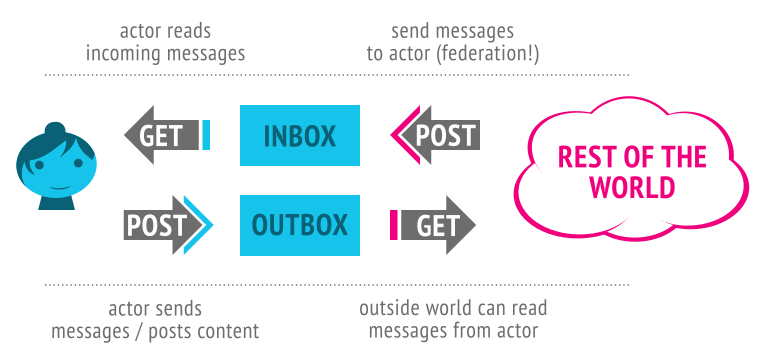

*This paper was written originally for the 2017 Rebooting Web of Trust*
*summit.*

**Contributors**
* Christopher Webber, Independent

# Introduction

[ActivityPub](https://www.w3.org/TR/activitypub/) is a protocol being developed at the [W3C](https://www.w3.org/) for the purpose
of building federated social systems.
Users can use implementations of ActivityPub like Mastodon and
MediaGoblin as libre alternatives to large siloed social networking
systems such as Facebook, Twitter, YouTube, and
Instagram.<sup id="fnr.1">[1](#fn.1)</sup>

In general ActivityPub follows the client-server paradigm that has
been popular on the World Wide Web, while restoring some level of
decentralization.
Current implementations of ActivityPub go as far as to bring a level
of decentralization akin to email,<sup id="fnr.2">[2](#fn.2)</sup> but
there are many opportunities to go further.
By attaching public keys to the profiles of actors (users) on the
network and using [Linked Data Signatures](https://w3c-dvcg.github.io/ld-signatures/), we can add a web of trust to
the federated social web and use it to enhance user privacy and assert
the integrity of messages sent over the network.
By using a decentralized identifier system such as
[Decentralized Identifiers (DIDs)](https://w3c-ccg.github.io/did-spec/) we can move fully from a decentralized
to a distributed system,<sup id="fnr.3">[3](#fn.3)</sup>
by escaping the core centralization mechanisms of DNS and SSL
certificate authorities.
At this point, users could even optionally transition from a
client-server model system to a fully peer to peer system.

# ActivityPub overview

<div class="center">
*This section is borrowed from the ActivityPub standard's*
*Overview section; if you are already familiar with ActivityPub*
*then you may skip this section.*
</div>

ActivityPub provides two layers:

-   **A server to server federation protocol:**
       so decentralized websites can share information
-   **A client to server protocol:**
    so users can communicate with ActivityPub using servers,
    from a phone or desktop or web application or whatever

ActivityPub implementations can implement just one of these things or
both of them.
However, once you've implemented one, it isn't too many steps to
implement the other, and there are a lot of benefits to both (making
your website part of the decentralized social web, and being able to
use clients and client libraries that work across a wide variety of
social websites).

In ActivityPub, every actor (users are represented as "actors" here)
has:

-   An **inbox**:  How they get messages from the world
-   An **outbox**: How they send messages to others


These are endpoints, or really, just URLs which are listed in the
ActivityPub actor's ActivityStreams description.
(More on ActivityStreams later.)

Here's an example of the record of our friend Alyssa P. Hacker:

``` json
    {"@context": "https://www.w3.org/ns/activitystreams",
     "type": "Person",
     "id": "https://social.example/alyssa/",
     "name": "Alyssa P. Hacker",
     "preferredUsername": "alyssa",
     "summary": "Lisp enthusiast hailing from MIT",
     "inbox": "https://social.example/alyssa/inbox/",
     "outbox": "https://social.example/alyssa/outbox/",
     "followers": "https://social.example/alyssa/followers/",
     "following": "https://social.example/alyssa/following/",
     "liked": "https://social.example/alyssa/liked/"}
```

ActivityPub uses [ActivityStreams](https://www.w3.org/TR/activitystreams-core/) for its [vocabulary](https://www.w3.org/TR/activitystreams-vocabulary/).
This is pretty great because ActivityStreams includes all the common
terms you need to represent all the activities and content flowing
around a social network.
It's likely that ActivityStreams already includes all the vocabulary
you need, but even if it doesn't, ActivityStreams can be extended
via [JSON-LD](https://json-ld.org/).
If you know what JSON-LD is, you can take advantage of the cool linked
data approaches provided by JSON-LD.
If you don't, don't worry, JSON-LD documents and ActivityStreams can be
understood as plain old simple JSON.
(If you're going to add extensions, that's the point at which JSON-LD
really helps you out.)

So, okay.
Alyssa wants to talk to her friends, and her friends want to talk to
her!
Luckily these "inbox" and "outbox" things can help us out.
They both behave differently for GET and POST.



So the full workflow is:

-   You can POST to someone's inbox to send them a message
    (server-to-server / federation only&#x2026; this *is* federation!)
-   You can GET from your inbox to read your latest messages
    (client-to-server; this is like reading your social
    network stream)
-   You can POST to your outbox to send messages to the world
    (client-to-server)
-   You can GET from someone's outbox to see what messages they've
    posted (or at least the ones you're authorized to see).
    (client-to-server and/or server-to-server)

Of course, if that last one (GET'ing from someone's outbox) was the
only way to see what people have sent, this wouldn't be a very
efficient federation protocol!
Indeed, federation happens usually by servers posting messages sent by
actors to actors on other servers' inboxes.

Let's see an example!
Let's say Alyssa wants to catch up with her friend, Ben Bitdiddle.
She lent him a book recently and she wants to make sure he returns it
to her.
Here's the message she composes, as an ActivityStreams object:

``` json
    {"@context": "https://www.w3.org/ns/activitystreams",
     "type": "Note",
     "to": ["https://chatty.example/ben/"],
     "attributedTo": "https://social.example/alyssa/",
     "content": "Say, did you finish reading that book I lent you?"}
```

This is a note addressed to Ben.
She POSTs it to her outbox.


Since this is a non-activity object, the server recognizes that this is
an object being newly created, and does the courtesy of wrapping it in
a Create activity.
(Activities sent around in ActivityPub generally follow the pattern of
some activity by some actor being taken on some object.
In this case the activity is a Create of a Note object, posted by a
Person.)

``` json
    {"@context": "https://www.w3.org/ns/activitystreams",
     "type": "Create",
     "id": "https://social.example/alyssa/posts/a29a6843-9feb-4c74-...",
     "to": ["https://chatty.example/ben/"],
     "actor": "https://social.example/alyssa/",
     "object": {"type": "Note",
                "id": "https://social.example/alyssa/posts/49e2d03d-b53a-4c4c-...",
                "attributedTo": "https://social.example/alyssa/",
                "to": ["https://chatty.example/ben/"],
                "content": "Say, did you finish reading that book I lent you?"}}
```

Alyssa's server looks up Ben's ActivityStreams actor object, finds his
inbox endpoint, and POST's her object to his inbox.


Technically these are two separate steps&#x2026; one is client to server
communication, and one is server to server communication (federation).
But, since we're using them both in this example, we can abstractly
think of this as being a streamlined submission from outbox to inbox.


A while later, Alyssa checks what new messages she's gotten.
Her phone polls her inbox via GET, and amongst a bunch of cat videos
posted by friends and photos of her nephew posted by her sister, she
sees<sup id="fnr.4">[4](#fn.4)</sup> the following:

``` json
    {"@context": "https://www.w3.org/ns/activitystreams",
     "type": "Create",
     "id": "https://chatty.example/ben/p/51086",
     "to": ["https://social.example/alyssa/"],
     "actor": "https://chatty.example/ben/",
     "object": {"type": "Note",
                "id": "https://chatty.example/ben/p/51085",
                "attributedTo": "https://chatty.example/ben/",
                "to": ["https://social.example/alyssa/"],
                "inReplyTo": "https://social.example/alyssa/posts/49e2d03d-b53a-...",
                "content": "Argh, yeah, sorry, I'll get it back to you tomorrow.
                            I was reviewing the section on register machines,
                            since it's been a while since I wrote one."}}
```

Alyssa is relieved, and likes Ben's post:

``` json
    {"@context": "https://www.w3.org/ns/activitystreams",
     "type": "Like",
     "id": "https://social.example/alyssa/posts/5312e10e-5110-42e5-...",
     "to": ["https://chatty.example/ben/"],
     "actor": "https://social.example/alyssa/",
     "object": "https://chatty.example/ben/p/51086"}
```

She POSTs this message to her outbox.
(Since it's an activity, her server knows it doesn't need to wrap it in
a Create object.)

Feeling happy about things, she decides to post a public message to her
followers.
Soon the following message is blasted to all the members of her
followers collection, and since it has the special Public group
addressed, is generally readable by anyone.

``` json
    {"@context": "https://www.w3.org/ns/activitystreams",
     "type": "Create",
     "id": "https://social.example/alyssa/posts/9282e9cc-14d0-42b3-...",
     "to": ["https://social.example/alyssa/followers/",
            "https://www.w3.org/ns/activitystreams#Public"],
     "actor": "https://social.example/alyssa/",
     "object": {"type": "Note",
                "id": "https://social.example/alyssa/posts/d18c55d4-8a63-4181-...",
                "attributedTo": "https://social.example/alyssa/",
                "to": ["https://social.example/alyssa/followers/",
                       "https://www.w3.org/ns/activitystreams#Public"],
                "content": "Lending books to friends is nice.
                            Getting them back is even nicer! :)"}}
```

# Bringing public key cryptography to the federated social web

We can dramatically improve the state of the federated social web by
having each actor on the system hold a public and private keypair, and
by having actors have their public key attached directly to their
actor object:

``` json
    {"@context": ["https://www.w3.org/ns/activitystreams",
                  "https://w3id.org/security/v1"],
     "id": "https://schemers.example/u/alyssa",
     "type": "Person",
     "name": "Alyssa P. Hacker",
     "publicKey": [{
        "id": "https://schemers.example/u/alyssa#main-key",
        "owner": "https://schemers.example/u/alyssa",
        "publicKeyPem": "-----BEGIN PUBLIC KEY-----\r\n..."}]}
```

This provides significant improvements to the system which we explore
below.

## Signing objects

Sharing messages is common in social networks.
But how can you verify that someone really said what they claimed?

The user Mallet is trying to cause havoc in their social network.
They pretend to "share"<sup id="fnr.5">[5](#fn.5)</sup> the following post they
pretend to have seen from Alyssa to the pasta-enthusiasts group, which
Ben is a member of.

``` json
    {"@context": "https://www.w3.org/ns/activitystreams",
     "type": "Announce",
     "id": "https://havoc.example/~mallet/p/90815",
     "to": ["https://pastalovers.example/groups/pasta-enthusiasts/"],
     "actor": "https://havoc.example/~mallet/",
     "object": {"type": "Note",
                "id": "https://social.example/alyssa/posts/63cc87ec-416e-437d-...",
                "attributedTo": "https://social.example/alyssa/",
                "to": ["https://havoc.example~mallet/"],
                "content": "Tortellini is a poor and disgusting imitation of ravioli.
                            Any chef serving tortellini should hang up their aprons
                            in disgrace and never cook again.",
                "signature": {
                  "type": "RsaSignature2017",
                  "creator": "https://social.example/alyssa/",
                  "created": "2017-09-23T20:21:34Z",
                  "nonce": "e3689a56da9b4bc",
                  "signatureValue": "mJfe5OCb7J3WwI...8t5/m="}},
     "signature": {
       "type": "RsaSignature2017",
       "creator": "https://social.example/alyssa/",
       "created": "2017-09-23T21:32:21Z",
       "nonce": "22e8e7683f56c08bb873",
       "signatureValue": "wTjLtnZVYF79pq9Ts...OU1jYPSjvcE2jNc="}}
```

In general ActivityPub follows the client-server paradigm that has
been popular on the World Wide Web, while restoring some level of
decentralization.
Current implementations of ActivityPub go as far as to bring a level
of decentralization akin to email,

Ben's server, or even the server hosting `pastalovers.example`, can
check the signature against the `publicKey` listed on Alyssa's actor
object.
This check fails, and so Mallet's attempt at slander of Alyssa amongst
the pasta enthusiast community fails.

While the above example looks at protecting against a malicious
interaction, forwarding and sharing content is desirable for positive
reasons.
One common problem in federated social networks that support private
interactions is that a conversation can become fragmented; if Ben is
posting to private collection<sup id="fnr.5">[5](#fn.5)</sup> she has
curated of both his friends and coworkers, if members of coworkers
can't see who is in the private family collection, even if they
address to include the family in the conversation they can't traverse
the collection of family actors to deliver to all relevant
participants.
(This "ghost replies" problem happens frequently on federated networks
even when messages are being sent to the actor's own `followers`,
where breaks tend to happen across server boundaries.)
ActivityPub includes a solution to this via a [forwarding mechanism](https://www.w3.org/TR/activitypub/#inbox-delivery),
but the solution does not really work without signatures, as
the forwards are happening indirectly rather than from the "same
origin/domain", so servers are unable to check/trust that the content
is as claimed.
Even if the receiving server tries to look up the object the
receiving actor's credentials, access control may not have been enabled
for the actor who was forwarded to, since the commenter had no way
of knowing who was in the private collection to enable access for.

This is a frequently requested feature in federated social networks,
so we should ensure that the necessary public key infrastructure is
provided.<sup id="fnr.6">[6](#fn.6)</sup>

## An easier to use web of trust?

The PGP-style "web of trust" has been around for some time now, but
the term "web of trust" is somewhat mired by the historically most
popular method by which the trust network has populated.
Key signing parties, while effective, have never taken off beyond
a very small set of the population.
Such parties are rewarding but difficult for most of the population to
attend and organize, and even more difficult still is learning the
(generally) command line tooling necessary to participate in the
system.
While some work has been done in this area (for example with
[Monkeysign](https://monkeysign.readthedocs.io/en/2.x/) and [Gibberbot](https://guardianproject.info/apps/gibber/)), it would be even better if building your
trust network was incidental to participating in the network.<sup id="fnr.7">[7](#fn.7)</sup>

To a certain extent, this could come "for free, with caveats" in
ActivityPub deployments that exist today, where subscriptions and
object lookup are done over HTTPS.
Merely by sending a follow request (or some other action connecting
users on the social graph) a certain amount of trust between users
can be expressed.
Keys can be looked up and recorded at actor profile urls, and users
can even observe and share information about whom else they know on
the social network.

There's a major caveat using HTTPS for these lookups requires trust in
SSL certificate authorities.
Better than nothing, but not great, and not the distributed systems
we want.
Furthermore, a malicious actor can still trick users;
a user may believe they are subscribing to
`https://social.example/alyssa/`, but perhaps Mallet tricked them
into subscribing to `https://social.example/alyssaa/`
instead.<sup id="fnr.8">[8](#fn.8)</sup>

Happily there are other ways to encourage stronger trust networks.
Carl Ellison's paper
*[Establishing Identity Without Certification Authorities](http://world.std.com/~cme/usenix.html)*
describes several classes of relationships amongst users,
and many Off The Record clients (such as available in Pidgin, etc)
provide interfaces for verifying challenges between users.
Users on a federated social network could be provided an opportunity
to perform a textual challenge, perform a brief video call where they
verify a shared code (as done in Jitsi), or scan a QR code (as in
Monkeysign and Gibberbot) to establish stronger trust that an actor on
the network is the entity they claim to be.
The level of trust gained could be signed, recorded, and itself
propagated as appropriate throughout the network.
This kind of mechanism would work nicely even in a system like DIDs,
where a human-readable identifier does not exist.

## End to end encryption

A malicious server administrator may still snoop on all communication
of participants on a system.
Even a non-malicious administrator may be coerced into snooping on
their users, or may have their entire system compromised without their
knowledge.
SSL Certificate Authorities may also be compromised into giving out
fake certificates, allowing man in the middle attacks that neither the
user nor server administrator may be aware of.

End to  end encryption can solve  this (with some tradeoffs);  in this
case, rather than having the server manage the public and private keys
of a user,  a user may provide  a public key on their  actor object to
which only their own computer(s) hold the corresponding private key.
Other actors on the network may then send an object encrypted to the
actor's inbox.
For example, an actor may receive the following object<sup id="fnr.9">[9](#fn.9)</sup>
in their inbox:

``` json
    {"@context": ["https://securityns.example/",
                  "https://www.w3.org/ns/activitystreams"],
     "type": "EncryptedEnvelope",
     "encryptedMessage": "-----BEGIN PGP MESSAGE-----\r\n...",
     "mediaType": "application/ld+json; profile=\"https://www.w3.org/ns/activitystreams\""}
```

The server would put this object in the user's inbox, but if only the
user's own computers hold the key, even the server would be unable to
read the contents held within the envelope.

Upon retrieving the object from the server via the client to server
protocol, the user's client can decrypt the message.
In this case, the message went directly to Alyssa's inbox.
Upon decrypting the component in encryptedMessage, another object
is found:

``` json
    {"@context": "https://www.w3.org/ns/activitystreams",
     "type": "Note",
     "id": "https://chatty.example/ben/p/86187",
     "to": ["https://social.example/alyssa/"],
     "attributedTo": "https://chatty.example/ben/",
     "content": "Up for some root beer floats at my friend's house?
                 Here's the address: ..."}
```

Note that while this improves privacy, it does come with several
tradeoffs:

-   ActivityPub contains an entire suite of [server side side-effects](https://www.w3.org/TR/activitypub/#server-to-server-interactions)
    for federating common activities on a social network.
    For example, a Like object will increment a counter of how often
    a post has been liked, and even add that liked object to both
    the user's collection of liked objects as well as a collection
    of all users who have liked this object.
    Since servers are unable to observe data being sent across the
    network, these kinds of side effects will break.
    The server will also be unable to provide additional features
    such as being able to have server-based indexing of messages
    for easy search.<sup id="fnr.10">[10](#fn.10)</sup>
    
    In a "more peer to peer" system (as discussed in the
    Distributed identity section) this becomes less of an issue
    because the distinction between client server blurs.
    Nevertheless, for existing client to server implementations,
    this is a strong issue to consider.

-   User maintenance of keys in end-to-end encryption systems is known
    to be a difficult user experience problem.

-   Key recovery is even harder.
    [DIDs](https://w3c-ccg.github.io/did-spec/) explore a method for key recovery, but this will not help
    users read old messages encrypted with keys they no longer have
    and which the original senders cannot send (or do not know how to).

# Distributed identity

ActivityPub implementations at the present moment rely on HTTPS as
their transport, which in turn relies on two centralized systems: DNS
and SSL certificate authorities.
Is there any way to bring self-sovereignty to the federated social web?

Thankfully there is; ActivityPub was written intentionally to be
layerable on any protocol that can support HTTP GET and POST verbs.
The [Decentralized Identifiers](https://w3c-ccg.github.io/did-spec/) specification looks to be a good fit
for ActivityPub.

The simplest version of this can be seen simply by replacing the actor
ids with DIDs.  To transform an example from the overview from:

``` json
    {"type": "Note",
     "attributedTo": "https://social.example/alyssa/",
     "to": ["https://chatty.example/ben/"],
     "content": "Say, did you finish reading that book I lent you?"}}
```

to:

``` json
    {"type": "Note",
     "attributedTo": "did:example:d20Hg0teN72oFeo0iNYrblwqt",
     "to": ["did:example:nJx2fgreaSfCujA0kMsiEW8Oz"],
     "content": "Say, did you finish reading that book I lent you?"}}
```

Gosh!  That was simple-ish.
All we did was replace the human-readable identifiers representing
the users with DIDs.
If we look up Alyssa's [DID](https://w3c-ccg.github.io/did-spec/#dids-(decentralized-identifiers)) based id, we can retrieve her actor object
as a [DDO](https://w3c-ccg.github.io/did-spec/#ddos-(did-descriptor-objects)), but this time there is extra information:

``` javascript
    {
      "@context": ["https://example.org/did/v1",
                   "https://www.w3.org/ns/activitystreams"],
      "id": "did:example:d20Hg0teN72oFeo0iNYrblwqt",
      // ActivityPub actor information
      "type": "Person",
      "name": "Alyssa P. Hacker",
      "preferredUsername": "alyssa",
      "summary": "Lisp enthusiast hailing from MIT",
      "inbox": "https://9GaksjPhy0mWToTV.onion/alyssa/inbox/",
      "outbox": "https://9GaksjPhy0mWToTV.onion/alyssa/outbox/",
      "followers": "https://9GaksjPhy0mWToTV.onion/alyssa/followers/",
      "following": "https://9GaksjPhy0mWToTV.onion/alyssa/following/",
      "liked": "https://9GaksjPhy0mWToTV.onion/alyssa/liked/",
      // DDO information
      "owner": [{
        "id": "did:example:d20Hg0teN72oFeo0iNYrblwqt#key-1",
        "type": ["CryptographicKey", "EdDsaPublicKey"],
        "curve": "ed25519",
        "expires": "2017-02-08T16:02:20Z",
        "publicKeyBase64": "lji9qTtkCydxtez/bt1zdLxVMMbz4SzWvlqgOBmURoM="
      }, {
        "id": "did:example:d20Hg0teN72oFeo0iNYrblwqt#key-2",
        "type": ["CryptographicKey", "RsaPublicKey"],
        "expires": "2017-03-22T00:00:00Z",
        "publicKeyPem": "----BEGIN PUBLIC KEY-----\r\n.."
      }],
      "control": [{
        "type": "OrControl",
        "signer": [
            "did:example:d20Hg0teN72oFeo0iNYrblwqt",
            "did:example:8uQhQMGzWxR8vw5P3UWH1j"
        ]
      }],
      "created": "2002-10-10T17:00:00Z",
      "updated": "2016-10-17T02:41:00Z",
      "signature": {
        "type": "RsaSignature2016",
        "created": "2016-02-08T16:02:20Z",
        "creator": "did:example:8uQhQMGzWxR8vw5P3UWH1j#key/1",
        "signatureValue": "IOmA4R7TfhkYTYW8...CBMq2/gi25s="
      }
    }
```

Hoo!  That's a lot of additions.
Except here we see an example of Alyssa's profile that is entirely
free of traditional centralized DNS authorities.
We were able to look up Alyssa's object via her DID, but we still
have access to all her endpoints, which in this case are pointing
to [Tor Hidden Services](https://www.torproject.org/docs/hidden-services.html.en).
No central DNS required!

Maybe in the future there is even a protocol &#x2013; let's call it
`httpeer` &#x2013; which supports all the standard HTTP verbage, but
over some other peer to peer network.
The DID spec supports [service endpoints](https://w3c-ccg.github.io/did-spec/#service-endpoint-references-(optional)), and Alyssa could take
advantage of these to use her DID as base of the `inbox`, `outbox`,
etc URIs.
Here's a cut down and modified version of the previous example:

``` javascript
    {
      "@context": ["https://example.org/did/v1",
                   "https://www.w3.org/ns/activitystreams"],
      "id": "did:example:d20Hg0teN72oFeo0iNYrblwqt",
      // ActivityPub actor information
      "type": "Person",
      "name": "Alyssa P. Hacker",
      "preferredUsername": "alyssa",
      "summary": "Lisp enthusiast hailing from MIT",
      "inbox": "did:example:d20Hg0teN72oFeo0iNYrblwqt/inbox/",
      "outbox": "did:example:d20Hg0teN72oFeo0iNYrblwqt/outbox/",
      "followers": "did:example:d20Hg0teN72oFeo0iNYrblwqt/followers/",
      "following": "did:example:d20Hg0teN72oFeo0iNYrblwqt/following/",
      "liked": "did:example:d20Hg0teN72oFeo0iNYrblwqt/liked/",
      // DDO information goes here
      "service": {
        "httpeer": "dI0tuXjISZEadSH6QV9EhBEdccL4ouePdF8P57BJ"}}
```


Now that's an identity system!

# Append only systems and content addressed storage

Finally, it's worth mentioning the idea of moving ActivityPub to an
entirely append-only, content-addressed system for object storage,
"modification", and retrieval.
Much success has been seen in recent years with these systems, and
doing so would allow for many of the side effects in the federation
system to be dropped entirely.
We leave this as a topic for a future paper.

# Conclusions

ActivityPub goes a long way towards providing a standardized way to
move the social web from isolated, centralized silos towards the
decentralized nature that the World Wide Web is meant to encompass.
Still, there is much to be done and improved.
Yet there are risks in trying to engineer the right system all at
once, and great is well known to be the enemy of good.

Thankfully we do not need to throw out what we have to make the
improvements which are discussed in this paper.
ActivityPub already exists and works, and we can incrementally
improve the systems we have and blur the line between the
federated social web that works and more peer to peer systems
which are desirable.
By adding public key infrastructure and distributed identifiers to
ActivityPub we can move from a decentralized system to a distributed
one and truly build a network that is both self-sovereign and social.

# Acknowledgments

Thanks to Evan Prodromou and Owen Shepherd for working on
initial revisions of the ActivityPub standard.
Thanks also to Jessica Tallon for being co-editor on ActivityPub
and [everyone who helped make ActivityPub happen](https://www.w3.org/TR/activitypub/#acknowledgements), which is no small
list.
(Some of those people caught typos in the original version of the
overview, as included in ActivityPub.)

Thanks to Manu Sporny and Stephen Webber for thoughts and feedback
about how to make ActivityPub into a more robust distributed system.
Thanks to Dave Longley for pointing to the vocabulary drift / ambiguity
of the terms "decentralized" and "distributed", which lead to the
addition of Paul Baran's diagrams and some terminology
clarification.<sup id="fnr.3">[3](#fn.3)</sup>
Thanks to Morgan Lemmer-Webber for the patience and for careful
proofreading of this document.

Thanks to Spec-Ops and Digital Bazaar for supporting my work/time on
Verifiable Claims/Credentials.
Though separate from my work on ActivityPub, obviously I've been
thinking a lot about how to combine them this whole time.

Thanks also to mray for the gorgeous illustrations in the overview
section.

This document and its images (with the exception of Paul Baran's
drawings), like ActivityPub itself, are licensed under
[W3C's permissive document license](https://www.w3.org/Consortium/Legal/2015/copyright-software-and-document).

<div id="footnotes">
<h2 class="footnotes">Footnotes: </h2>
<div id="text-footnotes">

<div class="footdef"><sup><a id="fn.1" name="fn.1" class="footnum" href="#fnr.1">1</a></sup> Of course, there is nothing stopping
current-silos of social networking from adopting ActivityPub, would
they be willing to un-silo their users.</div>

<div class="footdef"><sup><a id="fn.2" name="fn.2" class="footnum" href="#fnr.2">2</a></sup> Observant readers may note that email is
no longer as decentralized of a system as it once was.
Consider this a lesson that a protocol alone cannot build a
distributed network; the community must build and maintain a healthy
number of nodes and avoid the temptation to let a few large providers
control the space of a federated network.</div>

<div class="footdef"><sup><a id="fn.3" name="fn.3" class="footnum" href="#fnr.3">3</a></sup>
It is worth spending some time to
discuss what is meant by "centralized" versus "distributed" versus
"decentralized".


In the figure above we see images from
Paul Baran's 1964 paper on the subject, and from these shapes we can
see the kinds of shapes we mean: social silos resemble the the
spoke-like centralized model, client-server federated social networks
resemble the tree-like decentralized model, and a peer to peer network
resembles the mesh-like distributed model.
Since the writing of that paper there has been significant vocabulary
drift (perhaps because English is such a decentralized/distributed
language) and [clarifying the meaning of these terms](https://medium.com/@VitalikButerin/the-meaning-of-decentralization-a0c92b76a274) can be difficult.
(In [one popular post on the Ethereum Stack Exchange](https://ethereum.stackexchange.com/a/7813), a diagram that looks
almost exactly like Baran's diagram appears, but with the Decentralized
and Distributed labels reversed!)
The goal of this paper is really to seek out the systems which promote
the greatest amount of reliability, security, and user autonomy, and
some of the methods discussed, such as public key cryptography,
promote both.
Nonetheless, when the terms "decentralized" and "distributed" are used
and meaning is to be sought out, look to Baran, for sometimes pictures
are more descriptive than words.</div>

<div class="footdef"><sup><a id="fn.4" name="fn.4" class="footnum" href="#fnr.4">4</a></sup> Alyssa probably would not likely see the JSON-LD objects
directly as described here, but the author believes that some
narrative context still assists in the explaination of a UI-agnostic
protocol.</div>

<div class="footdef"><sup><a id="fn.5" name="fn.5" class="footnum" href="#fnr.5">5</a></sup> `Announce` is essentially `Share` in ActivityStreams.
The author of this document is not responsible for that terminology
decision.</div>

<div class="footdef"><sup><a id="fn.6" name="fn.6" class="footnum" href="#fnr.6">6</a></sup> In ActivityPub, `Collection` objects may
be used to contain sets of objects.
Users of the system can curate sets of actors in collections that
are publicly or privately readable which may be used for the
addressing of distributed objects (similar to Google+'s circles or
Diaspora's aspects).
Indeed, even the actor's `followers` is a `Collection` like this!</div>

<div class="footdef"><sup><a id="fn.7" name="fn.7" class="footnum" href="#fnr.7">7</a></sup> Several decisions need to be made
when storing signatures on objects which themselves reference other
signed objects that may mutate, and this is
[currently a topic of open discussion](https://github.com/w3c-dvcg/ld-signatures/issues/7).
This may motivate more work on
append only systems and content addressed storage.
Existing implementations which operate in a mutation-prone environment
must decide between letting signatures referencing mutated objects
fail, including such objects recursively on every parent object,
or employ some sort of content addressing of objects stored by the
revision seen.
The latter two options may pose some challenge to highly relational
systems which were not originally designed with signatures in mind.</div>

<div class="footdef"><sup><a id="fn.8" name="fn.8" class="footnum" href="#fnr.8">8</a></sup> [GNU Ring](https://ring.cx/) is an interesting example of a peer to peer
social network system where a user's identity is actually their
fingerprint.  While not the first system to have this concept, it's
very pleasant to see in action (and the interface is itself
aesthetically pleasing); to build up your buddy list is quite
literally to build your web of trust.</div>

<div class="footdef"><sup><a id="fn.9" name="fn.9" class="footnum" href="#fnr.9">9</a></sup> There are an incredible number of [unicode hacks](http://www.unicode.org/Public/security/latest/confusables.txt)
which can trick even the most careful of technical users as well.</div>

<div class="footdef"><sup><a id="fn.10" name="fn.10" class="footnum" href="#fnr.10">10</a></sup> `https://securityns.example/` is an imaginary
json-ld context which is used only as a placeholder for the terms of
`EncryptedEnvelope` and `encryptedMessage`.
Perhaps in the future terms along these lines (maybe with better names)
would appear in one of the other contexts/namespaces that appear in
this document.</div>

<div class="footdef"><sup><a id="fn.11" name="fn.11" class="footnum" href="#fnr.11">11</a></sup> This is not unlike how PGP-wrapped email works.
Receiving PGP-encrypted email means that a webmail interface would be
unable to search through your messages.
However, that does not mean searching is impossible; some programs like
[mu](http://www.djcbsoftware.nl/code/mu) / [mu4e](https://www.djcbsoftware.nl/code/mu/mu4e.html) can index encrypted email locally and provide such a search
interface, on a user's local machine.</div>


</div>
</div>
