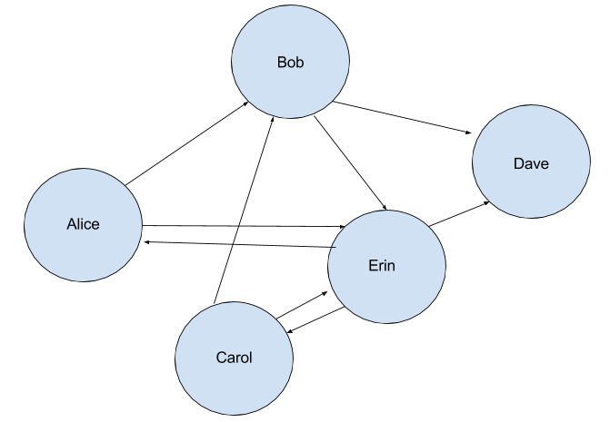
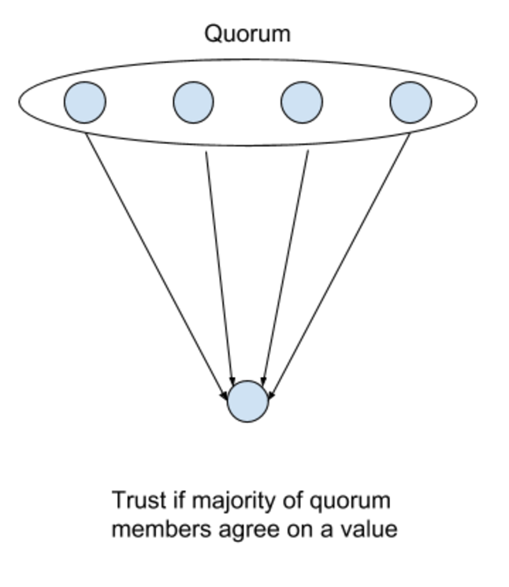
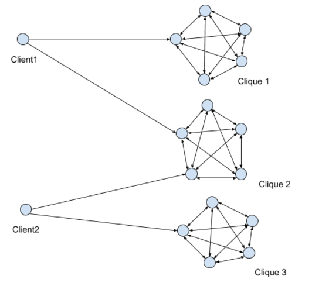
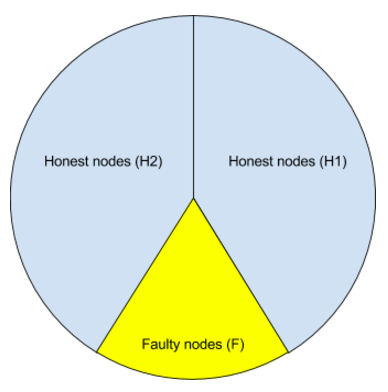
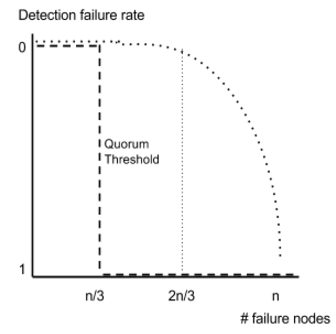
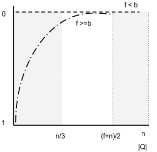
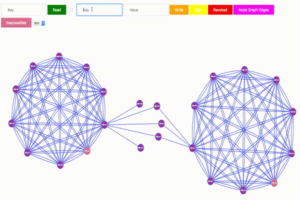
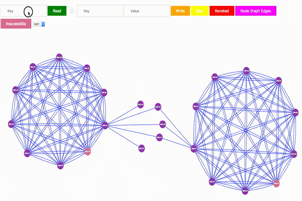

Implementation available at https://github.com/yahoo/bftkv

# BFTKV
Reliable data storage is one of the fundamental problems.
BFTKV uses [b-masking quorum](http://www.cs.utexas.edu/users/lorenzo/corsi/cs380d/papers/bquorum-dc.pdf) based `read`/`write` operations to
ensure [Byzantine fault-tolerance](https://dl.acm.org/citation.cfm?id=357176) and GPG's [Web of Trust](https://www.gnupg.org/gph/en/manual/x547.html) 
mechanism to build trust relationships between entities. Trust relationships are used to build quorums.

Moreover, BFTKV provides the following guarantees:

* Value corresponding to the key is up to date and not forged
* Entities trying to deceive users will be revoked immediately
* Entities can join and leave the system dynamically
* Communications between entities are encrypted using public keys

# Design
BFTKV leverages integration of three concepts to provide a Byzantine fault tolerant distributed key-value storage:

* Byzantine Quorum Systems
* Web of Trust
* Quorum Certificate

In this document, we will first describe PGP's Web of Trust mechanism and then build the other concepts on top of it. 

## Background
### Web of Trust
Web of Trust is a way of building trust between entities without a central authority, unlike Public Key Infrastructure (PKI).
Trust is established by signing public keys (implies the signer trusts the owner of the signed public key). A Web of Trust
is created by exchanging signed keys between entities. 
 
Trust relationships can be represented with a graph, such as this:
 


The graph can be transcribed as:
```
Alice trusts Bob and Erin
Bob trusts Erin and Dave
Carol trusts Bob and Erin
Erin trusts Alice, Carol and Dave
```

Web of Trust mechanism plays a huge role in BFTKV's quorum selection mechanism.

### Byzantine Quorum Systems
In a network system, servers might be inaccessible or return wrong/not up to date data. Byzantine failure refers to
both of these failures and the naming is based on [The Byzantine General's Problem](https://dl.acm.org/citation.cfm?id=357176).

BFTKV uses `b-masking quorum`s to tolerate Byzantine failures where `b` is the number of failure nodes.
`b-masking quorum`s are due to Malkhi and Reiter ([Paper](http://www.cs.utexas.edu/users/lorenzo/corsi/cs380d/papers/bquorum-dc.pdf)).

### Quorum Certificate
Castro and Liskov ([Paper](http://pmg.lcs.mit.edu/papers/osdi99.pdf)) introduced
a Byzantine fault tolerant replication mechanism that expects `f+1` responses
from the servers to verify the data, where `f` is the number of faulty nodes. We use the Web of Trust mechanism to specify
the nodes that their responses will be accepted by a quorum member.



The following parts of this document deals with how previously discussed concepts are
used in BFTKV.

## Implementation
### Quorum Selection
Quorum selection is based on the trust graph built using the Web of Trust mechanism. BFTKV, usually, chooses the maximal cliques that are
`L` hops away from the clients. For example,



Client1 has two cliques: Clique 1 and Clique 2 where `L=1`
Client2 has two cliques: Clique 2 and Clique 3 where `L=1`

### Write
The `Write` procedure saves a value associated with a key in the system. A high-level pseudocode for the procedure:

1. Choose a quorum.
2. Get times for the key from quorum members.
3. Pick a new time that is higher than the maximum time returned by the quorum members.
4. Request and gather signatures from quorum members for new value for the key with the new timestamp.
5. Choose another quorum that includes the first quorum.
6. Write the key, value and signature set to the new quorum members.

### Read
The `read` procedure reads a value associated with a key in the system. A high level pseudocode for the procedure:

1. Choose a quorum.
2. Collect values associated with the key
3. Revoke signers who signed different values with the same timestamp.
4. Return value having signatures more than the number of faulty nodes and has the maximum timestamp.

### Design Decisions and Security Analysis
In this section, we will go over somewhat unclear points in the chapters we discussed `read`/`write` operations.

#### Write 

1. The quorum `Q` chosen here should have the property `|Q| >= 3b + 1` where `b` is the number of faulty nodes. This is required for Byzantine fault
tolerance since `f` nodes may be inaccessible and `f` nodes may be returning a previous value for the key. The remaining honest `f + 1` nodes will keep the
system in a safe condition. As `Q`, BFTKV uses a maximal clique that a client is connected to in the trust graph.
2. Number of timestamps should be greater than or equal to `2b + 1` since we will tolerate `b` inaccessible nodes.
3. -
4. The number of signatures `m` should be greater than `b + (n - b) / 2`. Please see the security analysis for details.
5. All nodes may be chosen which is BFTKV's current strategy.
6. Before writing, each server verifies the signature, checks the number of valid signatures gathered from quorum members and accepts write if the number
is greater than `b + (n - b) / 2`. Moreover, every server makes sure that they haven't signed this key with the same timestamp before. 
7. `write` operation succeeds if the received acks from server is greater than `2f + 1`.


#### Read

1. BFTKV chooses a random quorum `Q` that has the property `|Q| > b + (n - b) / 2`.
2. Collect pairs up to `2f + 1`. The reason is the same with `write` operation second explanation.
3. A server should not sign the same key, same timestamp and a different value. This is equivocation attack.
It is very important that servers revoke these nodes at this phase for the system to survive.
4. To return a value for the key, the value should have at least `b + 1` signatures, which guarantees that the value is valid, and have the maximum timestamp.

### Security Analysis
**Equivocation Attack:** An adversary can try to create two different views of a quorum by trying to store different values for a key in half of the quorum and
another value in the other half (Half is the best option from an attacker's perspective if he wants to succeed). With the help of the `b` faulty nodes, the basic check for
`b + 1` signatures will succeed. However, if the quorum size is chosen carefully, this can be prevented.

Consider the node states below (`n` = the number of nodes in the quorum, `b` = faulty nodes in the quorum):



Maximum number of signatures an attacker can get is `b + (n - b) / 2`. To make sure that the majority has the correct value `n - b > b + (n - b) / 2` should hold. Therefore `n`
should be greater than `3b`.

### Detecting Equivocation on Read
Let `Fp` define the failure probability of an adversary (i.e., he won't be detected); `H1` and `H2` honest node sets, `F` the set of faulty nodes and `N = H1 U H2 U F`.
Then the nodes chosen from the quorum `Q` should be either from `H1 U F` or `H2 U F` to prevent detection. This probability is

```
Fp ~= 1 - ((|F| + |N|) / 2|N|)^|Q|
```

In a reqular quorum system after if the number of faulty nodes exceed `n/3` trust to data drops down to 0. BFTKV can keep the adversary's failure probability
close to 1 for more than `f` failing nodes. Below two graphs represent this:

<p float="left">
  
   
</p>

### Visualization of the System
### Write in Action


### Revoke on Read in Action


