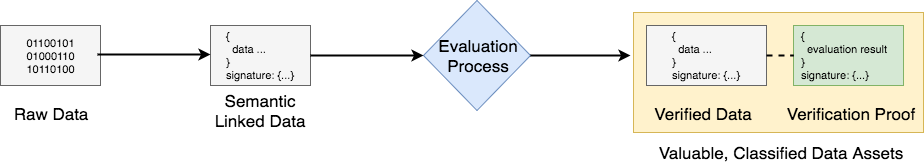
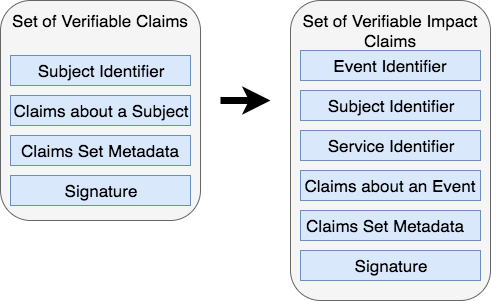
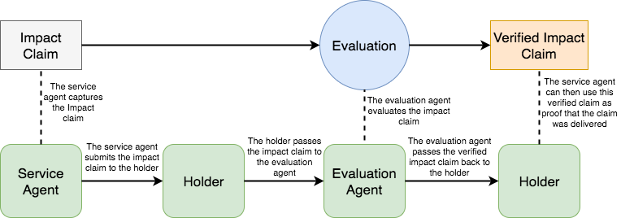

# Verifiable Claims of Impact #

### _Public Working Draft dated 21 September 2017_
Cedric Franz (Trustlab), Dr Shaun Conway (ixo Foundation)

**Impact Claims** are a new use-case for Verifiable Claims and the DID specification. We propose this could become a standard that will transform how information gets collected, evaluated, valued and exchanged to optimise Sustainable Development impacts.

The context for this is the UN’s 17 Global Goals to end poverty, protect the planet, and ensure prosperity for all, by 2030. To create a world that counts, the UN Secretary-General has called for a data revolution for sustainable development.
The prototype Impact Claims specification is a core part of the **ixo Protocol** that provides a decentralised mechanism to generate verified impact data as a fungible asset that can be traded for funding and other forms of value-exchange. This protocol increases the accountability and transparency of impact funding and service provision, whilst also generating a dynamic data commons for sustainable development. See the ixo White Paper for more information.



The ixo protocol follows the archetypical process for transforming raw data into valuable, classified data assets, through an evaluation process, as depicted in the figure. It is interesting to think that this generic pattern applies to virtually any type of information. For instance, when music files are evaluated or curated by listeners applying star-ratings. 
The use-case we describe here could be extended to any evaluation process where the identities of service agents, evaluation agents, beneficiaries and purchasers is of some consequence. 
We are interested to explore the generalisability of this model, which could be thought of as Verifiable Claims about facts that are extrinsic to the identities of the subject/s or participants in an event or process. This contrasts with the established use of Verifiable Claims about facts that are intrinsic to the identity of the subject/s of the claim.

In the case of Impact Claims, data inputs are semantically structured using a data model that we have derived from the Verifiable Claims standard. Claims are evaluated through a decentralised impact exchange mechanism, using a system of Ethereum Blockchain smart contracts to coordinate and incentivise participants to process and verify the claims data in this way. The evaluation can be carried out by identified human evaluation agents (augmented with software tools), or entirely conducted by identified software oracles. As claims pass the evaluation requirements, this produces valuable Verified Impact Claims Data and the tokenized representation of the data, which gets recorded as transactions in a distributed public ledger.

We use the popular term *High-Definition* to describe information outputs that are produced through this process. This is *higher-resolution* because all data points resolve to unique identifiers (using the DID spec) and it is *higher-fidelity* because the data gets reliably structured (using semantically defined linked-data schemas), as well as cryptographically authenticated and secured.

A prototype data model for Impact Claims is described below. We are interested to review this as a canonical equivalent to or derivative of the Verifiable Claims data model. We are also keen to address a number of outstanding specification and technical implementation questions (outlined at the end of this paper) that have arisen through our initial phase of work.

***

# Impact Claims Data Model

The Impact Claims data model is derived from the Verifiable Claim standard that is currently under consideration by the [W3C Verifiable Claims Working Group](https://www.w3.org/TR/verifiable-claims-data-model/). This incorporates standards such as [Linked Data Signatures 1.0 Draft](https://w3c-dvcg.github.io/ld-signatures/).
Impact Claims are distinctive in that they record structured information about the delivery of impact services and/or goods by identified **service agents**, to identified **beneficiaries**.
It is useful to understand the basic terminology and structure of an Impact Claim.

How Impact Claims compare with Verifiable Claims:



## Terminlology ##

**impact claims**
> Statements made by an entity about an event that involves an identified subject. The claim is effectively tamper-proof as this is cryptographically secured. The identity of the author is cryptographically authenticated by a digital signature.

**entity**
> An identifiable person, organization, concept, or device with a provable existence.

**holder**
> An entity that is in control of one or more verifiable impact claims. Typically a holder is also the issuer of their verifiable impact claims.

**issuer**
> An entity that creates verifiable impact claims, associates these with a particular event, and transmits the claims to a holder.  For Impact Claims, this is typically a **service agent**

**service agent**
> An entity that delivers a services and/or goods that result in sustainable development impacts.  The entity could be a person or a machine. *Examples: nurse administring a vaccinantion; fingerprint scanner recording attendance*

**evaluation agent**
> An entity that undertakes an evaluation processes to verify Impact Claims. This could be a manual task performed by a person and/or automated and augmented by a software agent.

### Impact claim processing requirements

This section outlines the roles and relationships between identified participants that are required to process Impact Claims.




A **service agent** creates Impact Claims

A **holder** receives and stores Impact Claims from the **service agent**

The **holder** mediates the transmission of Impact claims between the service agents and evaluation agents

Impact claims are associated with **impact indicators**

**Service agents** should be able to easily control and own their own identifiers

**Holders** must be able to freely choose and change the agents they employ to help them manage and share their impact claims.

### Data Model
Impact Claims contain the following information in a structured linked-data model:

**claims data**
> A set of data elements captured by an entity. Impact claims are effectively tamper-proof. The authorship of impact claims can be cryptographically verified. Claims must include the following properties:
- **templateID**: Hash Value of the impact claim template
- **contractID**: Hash Value of the contract governing these claims
- **indicator**: A standard measurement metric defined in an indicator schema
- **claimDate**: The date and time the impact claim is made
- **impactDate**: The date and time the impact was delivered
- **location**: The geo-location where the impact claim was delivered
- **serviceAgentID**: The DID of the service agent
- **serviceID**: The DID of an entity with which the service agent is associated
- **reason**: A text field descibing why this impact was delivered.  This is captured from the impact claim template
- **result**: The result of the outcome of the service delivery captured by the service agent
- **beneficiaries** *(optional)*: Is a list of DIDs for beneficiaries of this impact service
- **productsUsed** *(optional)*: An array of the product identifiers for commodities used in the delivery of the impact

**metadata**
> A set of metadata that is included with the claim that captures information regarding how, what, where and when the claim event occurred

**signature**
> The claim is signed by the claim issuer using a cryptographic signature to ensure the authenticity of the authorship of the impact claim


### JSON-LD Syntax

This section defines how the data model described in Data Model Section is realized in JSON-LD. Although syntactic mappings are only provided for these three different languages, applications and services may also use any other data representation language (XML, for example) that can support the data model.

### Example: Verifiable Impact Claim ###
```json-ld
{
  "@context": [
    "http://schema.cnsnt.io/",
    "http://schema.org/",
    “http://ixo.foundation/schema”,
    "https://w3id.org/identity",
    "https://w3id.org/security/v1",
    "https://iris.thegiin.org/indicators",
  ],

  "type": "ImpactClaim",


  “templateID” : "0x4600a18666a9f08f2f99a79ce8734e5b6f353a91",
  "contractID" : "0xb4b59c3acfeb9afd9398c88b2f6f003cbf29b553"
  "indicator": {
    "type": "Indicator",
    "brand": "IRIS",
    "code": "PI9468"
  },
  "claimDate": "2016-02-08T16:02:20Z",
  "impactDate": "2016-02-08T16:02:20Z",
  "location": {
    "latitude": "12.01156874",
    "longitude": "-175.57177874"
  },
  "serviceAgentID": "did:sov:21tDAKCERh95uGgKbJNHYp",
  "serviceCenterID": {
    "branch": "Cape Town",
    "geo": {
      "location": {
        "latitude": "12.01156874",
        "longitude": "-175.57177874"
      },
    }
  },
  "productsUsed": [],
  “claimData”: "ixo:ImpactClaimData"
  "reason": "Water provided",
  "result": {
    "type": "Rating",
    "ratingValue": "79"
  },

  "signature": {
    "type": "RsaSignature2016",
    "created": "2016-02-08T16:02:20Z",
    "creator": "did:example:8uQhQMGzWxR8vw5P3UWH1j#key/1",
    "signatureValue": "IOmA4R7TfhkYTYW8...CBMq2/gi25s="
  }

}

```


### Schema ###
```json-ld
{
   "@context": {
     "type": "@type",

     "cn":  "http://schema.cnsnt.io/",
     "so":  "http://schema.org/",
     "ixo": “http://ixo.foundation/schema”,
     "id":  "https://w3id.org/identity",
     "sec": "https://w3id.org/security/v1",
     "ind": "https://iris.thegiin.org/indicators",

     “templateID” : "ixo:TemplateRef"
     “contractID” : "ixo:ContractRef"
     "indicator": ixo:ImpactIndicator"
     "claimDate": "so:Date",
     "impactDate": "so:Date",
     "location": "so:GeoCoordinates"
     "serviceAgentID": "ixo:ServiceAgent",
     "secondaryServiceAgents": "ixo:ServiceAgents"
     "serviceCenterID": "so:Place",
     "beneficiaries": "so:People",
     "productsUsed": "so:ItemList"
     “claimData”: "ixo:ImpactClaimData"
     "reason": "ixo:ImpactReason",
     "result": "ixo:ImpactResult",

     "signatureChain": "sec:SignatureChain"
}

```


## Next steps ##

We would like to invite collaborators to help further develop this specification and to consider if this use-case could feed into the W3C Verifiable Claims standardisation process.

### Questions ###

1. Is a Verifiable Impact Claim a subtype of a Verifiable Claim or should the Verifiable Claim be extended to include claims about events as well as subjects?
2. How to represent nested claims (for instance, when a device generates a claim within a service-delivery process)
3. How to bundle or connect a series of Impact Claims?
4. When new DID records are created for the same entity (such as a beneficiary), how to link together the claims so that these can be associated with the entity and avoid duplications?
5. Could Impact Claims be introduced to the W3C standards Verifiable Claims process?

## References ##
[Verifiable Claims Working Group](https://www.w3.org/TR/verifiable-claims-data-model/)

[Linked Data Signatures 1.0 Draft](https://w3c-dvcg.github.io/ld-signatures/)

[A World That Counts: Mobilising The Data Revolution for Sustainable Development](http://www.undatarevolution.org/report/)
